STUDENT INFORMATION:
- Name: Hoàng Xuân Dũng
- Student ID: ITITWE22009
- Class: Web Application Development Laboratory

- COMPLETED EXERCISES:
- [x] Exercise 1: Student List 
- [x] Exercise 2: Student Servlet Controller
- [x] Exercise 3: JSP Views for Student Management
- [x] Exercise 4: Integration Testing for Full CRUD Operations
- [x] Exercise 5: Search
- [x] Exercise 6: Validation
- [x] Exercise 7: Sorting & Filtering
- [x] Exercise 8: Pagination
- [x] Bonus 1: Export Excel
- [x] Bonus 1: Photo Upload 
- [x] Bonus 1: Combined Search + Filter + Sort  

MVC COMPONENTS:
- Model: Student.java
- DAO: StudentDAO.java
- Controller: StudentController.java
- Views: student-list.jsp, student-form.jsp

FEATURES IMPLEMENTED:
- All CRUD operations
- Search functionality
- Server-side validation
- Sorting by columns
- Filter by major

KNOWN ISSUES:
- [List any bugs]

EXTRA FEATURES:
- [List any bonus features]

TIME SPENT: [1 day]


# Exercise 1 – Student List (Model & DAO)

## OUTPUT
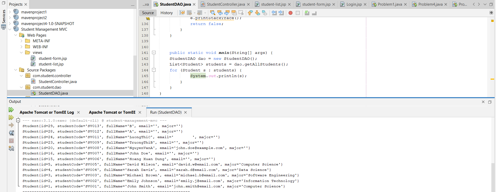

## 1. Purpose of Exercise 1

Exercise 1 focuses on building the **Model** and **Data Access Object (DAO)** layers for a simple *Student Management* application.  
The goal is to:

- Represent student data as a Java object (`Student`).
- Connect to a MySQL database.
- Retrieve all student records from the `students` table.
- Store those records in a `List<Student>` and display them (via `System.out.println` in the console).

This exercise prepares the foundation for later steps where a Servlet controller and JSP views will be added (full MVC).

---

## 2. Class `Student` – The Model

### 2.1 Role

`Student` is a **JavaBean / POJO** that represents one row in the `students` table.  
Each object of this class holds all data of a single student.

### 2.2 Main Fields

Typical fields in `Student` (based on the lab template) are:

- `id` – unique primary key (int).
- `studentCode` – student code / ID used by the school (String).
- `fullName` – full name of the student (String).
- `email` – email address (String).
- `major` – major / field of study (String).
- `createdAt` – timestamp when the record was created (`Timestamp`).

### 2.3 JavaBean Requirements

The class follows the JavaBean pattern:

- **Private fields** – data is encapsulated.
- **Public no-argument constructor** – required for frameworks and JSP EL.
- **Public getters and setters** – `getId()`, `setId(int id)`, etc.
- An optional **`toString()`** override to format the object when printed (used later by `System.out.println(s)`).

### 2.4 How `Student` Is Used in This Exercise

- The DAO (`StudentDAO`) **creates `Student` objects** for each row returned from the database.
- These objects are stored inside a **`List<Student>`**.
- The `main` method later prints each `Student` object; the console output is produced by the `toString()` method of `Student`.

---

## 3. Class `StudentDAO` – The Data Access Layer

### 3.1 Role

`StudentDAO` is responsible for **all interaction with the database**.  
Instead of putting SQL directly in JSP or in the Servlet, the DAO:

- Opens connections to the MySQL database.
- Executes SQL queries (e.g., `SELECT * FROM students ...`).
- Converts `ResultSet` rows into `Student` objects.
- Returns these objects to the caller as Java collections.

This separation makes the code easier to maintain, test, and reuse.

### 3.2 Database Configuration

At the top of `StudentDAO`, there are constants:

- `DB_URL` – the JDBC connection string, e.g.  
  `jdbc:mysql://localhost:3306/student_management`
- `DB_USER` – database username, e.g. `"root"`.
- `DB_PASSWORD` – database password.

These constants define **which database** and **which user** the application connects with.

### 3.3 `getConnection()` Method – Opening a Database Connection

The private method `getConnection()`:

1. Loads the MySQL JDBC driver (usually with `Class.forName("com.mysql.cj.jdbc.Driver")`).
2. Calls `DriverManager.getConnection(DB_URL, DB_USER, DB_PASSWORD)` to obtain a `Connection` object.
3. Returns that `Connection` to the caller.

If something goes wrong (e.g. driver missing or wrong URL/credentials), an exception is thrown and typically handled by the caller.

This method centralizes connection logic so it can be reused by all DAO methods.

---

## 4. Listing Students – `getAllStudents()` and `List<Student>`

### 4.1 Purpose

The most important method for Exercise 1 is **`getAllStudents()`**.  
This method:

- Reads **all student records** from the `students` table.
- Builds a `List<Student>` where each element represents one row from the database.
- Returns this list to the caller (for example, to `main()` or later to a Servlet).

### 4.2 Internal Flow of `getAllStudents()`

The typical structure of `getAllStudents()` (based on the lab template) is:

1. **Create an empty list**
   ```java
   List<Student> students = new ArrayList<>();
   ```
   This list will store all `Student` objects created from the database rows.

2. **Prepare SQL query**
   ```java
   String sql = "SELECT * FROM students ORDER BY id DESC";
   ```
   - `SELECT * FROM students` selects all columns from the table.
   - `ORDER BY id DESC` sorts by `id` in descending order so the newest record appears first.

3. **Open a connection and create a statement**
   ```java
   try (Connection conn = getConnection();
        Statement stmt = conn.createStatement();
        ResultSet rs = stmt.executeQuery(sql)) {
       ...
   }
   ```
   - `getConnection()` gives a `Connection` to the `student_management` database.
   - `createStatement()` creates a `Statement` for running the SQL.
   - `executeQuery(sql)` runs the SELECT and returns a `ResultSet`.

   The `try-with-resources` block ensures all resources (`Connection`, `Statement`, `ResultSet`) are automatically closed after use.

4. **Loop through the `ResultSet`**
   ```java
   while (rs.next()) {
       Student student = new Student();
       student.setId(rs.getInt("id"));
       student.setStudentCode(rs.getString("student_code"));
       student.setFullName(rs.getString("full_name"));
       student.setEmail(rs.getString("email"));
       student.setMajor(rs.getString("major"));
       student.setCreatedAt(rs.getTimestamp("created_at"));

       students.add(student);
   }
   ```
   - `rs.next()` moves to the next row from the database.
   - For each row, a **new `Student` object** is created.
   - Column values are read by column name and assigned to the corresponding fields.
   - The completed `Student` is appended to the `students` list.

5. **Return the list**
   ```java
   return students;
   ```
   If any exception occurs, the method usually prints the stack trace and still returns the list (which might be empty).

### 4.3 How `List<Student>` Behaves

- The list is a **dynamic collection** – size depends on how many rows are in the table.
- If the `students` table is empty, `students.size()` will be `0`.
- Each element in the list is a fully populated `Student` object.
- The order of elements matches the `ORDER BY` clause (here: newest `id` first).

This list can later be:

- Printed in the console (Exercise 1).
- Passed to a Servlet and forwarded to a JSP for display in HTML (later exercises).

---

## 5. Code Execution Flow When Listing Students

### 5.1 Entry Point – `main` Method

At the bottom of `StudentDAO` (or in a separate test class), there is a `main` method:

```java
public static void main(String[] args) {
    StudentDAO dao = new StudentDAO();
    List<Student> students = dao.getAllStudents();
    for (Student s : students) {
        System.out.println(s);
    }
}
```

This method is used as a **simple console-based test** for Exercise 1.

### 5.2 Step-by-Step Execution

When you run the program (e.g., from IntelliJ IDEA or another IDE):

1. **JVM starts the application**  
   - The Java Virtual Machine looks for `public static void main(String[] args)` and starts executing from there.

2. **Create the DAO**
   ```java
   StudentDAO dao = new StudentDAO();
   ```
   - A new `StudentDAO` instance is created.
   - It now has access to all DAO methods, including `getAllStudents()`.

3. **Call `getAllStudents()`**
   ```java
   List<Student> students = dao.getAllStudents();
   ```
   - Control enters the `getAllStudents()` method.
   - Inside this method:
     - A database connection is opened via `getConnection()`.
     - SQL `SELECT * FROM students ORDER BY id DESC` is prepared and executed.
     - Each row in the `ResultSet` is converted into a `Student` object.
     - All `Student` objects are stored in a `List<Student>`.
   - After finishing, the method returns that list to `main`.

4. **Iterate through the list and print each student**
   ```java
   for (Student s : students) {
       System.out.println(s);
   }
   ```
   - The enhanced `for` loop visits each `Student` in the list.
   - `System.out.println(s)` calls `s.toString()` implicitly.
   - The `toString()` method of `Student` returns a string representation like:
     ```
     Student{id=1, studentCode='S001', fullName='John Doe', email='john@example.com', major='IT'}
     ```
   - This string is printed to the **console output** (the Run window in the IDE).

5. **Program ends**
   - After finishing the loop, `main` reaches the end of the method.
   - All local variables (including `dao` and `students`) are eligible for garbage collection.
   - The JVM terminates the program.

### 5.3 What You See on the Screen

When the list of students is displayed:

- The program does **not** open a web page yet.
- It prints each `Student` object as one line in the console.
- The **order** of the lines corresponds to the order of the rows from the database (due to `ORDER BY id DESC`).

For example:

```text
Student{id=3, studentCode='S003', fullName='Alice', email='alice@example.com', major='CS'}
Student{id=2, studentCode='S002', fullName='Bob', email='bob@example.com', major='SE'}
Student{id=1, studentCode='S001', fullName='Charlie', email='charlie@example.com', major='AI'}
```

---

## 6. Summary of the Overall Flow

1. **Model (`Student`)** defines what a student looks like in Java.
2. **DAO (`StudentDAO`)** knows how to:
   - Connect to the MySQL database.
   - Run a `SELECT` query on the `students` table.
   - Build a `List<Student>` from the query results.
3. **`main` method**:
   - Creates a `StudentDAO` instance.
   - Calls `getAllStudents()` to load data from the database.
   - Iterates through the returned `List<Student>` and prints each student.

At this stage (Exercise 1), the application is **console-based** but already follows a clean separation of concerns:

- **Data structure** is handled by the `Student` JavaBean.
- **Database operations** are encapsulated inside `StudentDAO`.
- **Program entry and display** are in the `main` method.

In later lab exercises, this core logic will be reused by Servlets and JSP views to build a full MVC web application.

---

# Exercise 2 – Student Servlet Controller (MVC Web Flow)

## 1. Purpose of Exercise 2

Exercise 2 focuses on building the **Controller layer** of a simple *Student Management* web application using **Servlets** and the **MVC pattern**.

In Exercise 1, you only had:

- A **`Student`** JavaBean (Model).
- A **`StudentDAO`** class that talked to the database.
- A **console-based** test (`main` method) that printed the list of students.

In Exercise 2, you:

- Replace the console `main` test with a **Servlet controller**: `StudentController`.
- Handle **HTTP requests from the browser** instead of running locally in the console.
- Integrate the **Model (`Student`)** and **DAO (`StudentDAO`)** with:
  - a **Controller** (`StudentController`),
  - and **JSP views** (e.g. `student-list.jsp`, `student-form.jsp`).
- Implement full CRUD flow: **list**, **new**, **insert**, **edit**, **update**, **delete** students.

---

## 2. Overview of `StudentController` – The MVC Controller

### 2.1 Class Role

`StudentController` is a **Servlet** that acts as the **Controller** in the MVC pattern:

- It receives HTTP **requests** from the browser.
- Reads parameters such as `action`, `id`, `studentCode`, etc.
- Calls the **DAO** (`StudentDAO`) to perform operations on the database.
- Pushes data into the **request scope** (e.g., `request.setAttribute("students", students)`).
- Chooses the correct **JSP view** and forwards/redirects to it.

### 2.2 Servlet Declaration and URL Mapping

At the top of the class:

```java
@WebServlet("/student")
public class StudentController extends HttpServlet {
    private StudentDAO studentDAO;
    ...
}
```

- `@WebServlet("/student")` maps the URL `/student` to this servlet.
  - Example URLs:
    - `GET /student`
    - `GET /student?action=list`
    - `GET /student?action=new`
    - `GET /student?action=edit&id=3`
    - `GET /student?action=delete&id=3`
    - `POST /student?action=insert`
    - `POST /student?action=update`
- Any web request with path `/student` will be handled by `StudentController`.

### 2.3 DAO Initialization (`init()` Method)

```java
@Override
public void init() {
    studentDAO = new StudentDAO();
}
```

- `init()` is called **once** when the servlet is first created by the container (Tomcat).
- It creates a single `StudentDAO` instance and assigns it to the field `studentDAO`.
- This DAO is then reused for all incoming requests, avoiding repeated creation.

---

## 3. HTTP GET Flow – `doGet(...)`

### 3.1 Method Structure

```java
@Override
protected void doGet(HttpServletRequest request, HttpServletResponse response) 
        throws ServletException, IOException {

    String action = request.getParameter("action");

    if (action == null) {
        action = "list";
    }

    switch (action) {
        case "new":
            showNewForm(request, response);
            break;
        case "edit":
            showEditForm(request, response);
            break;
        case "delete":
            deleteStudent(request, response);
            break;
        default:
            listStudents(request, response);
            break;
    }
}
```

### 3.2 Step-by-Step Logic

1. **Read the `action` parameter**
   - From the query string: `/student?action=list`, `/student?action=new`, etc.
   - `String action = request.getParameter("action");`

2. **Default action**
   - If `action` is `null`, the controller assumes `"list"`.
   - This means visiting `/student` with no `action` will show the **student list**.

3. **Dispatch by `switch`**

   - `action = "new"` → call `showNewForm(...)`
   - `action = "edit"` → call `showEditForm(...)`
   - `action = "delete"` → call `deleteStudent(...)`
   - Any other value (including `"list"`) → call `listStudents(...)`

This is how the controller decides **which operation** to perform when the browser sends a GET request.

---

## 4. HTTP POST Flow – `doPost(...)`

### 4.1 Method Structure

```java
@Override
protected void doPost(HttpServletRequest request, HttpServletResponse response) 
        throws ServletException, IOException {

    String action = request.getParameter("action");

    switch (action) {
        case "insert":
            insertStudent(request, response);
            break;
        case "update":
            updateStudent(request, response);
            break;
    }
}
```

### 4.2 Use Cases

- `POST /student?action=insert`
  - Submitted from the **“Add New Student”** form.
  - Controller calls `insertStudent(...)`.

- `POST /student?action=update`
  - Submitted from the **“Edit Student”** form.
  - Controller calls `updateStudent(...)`.

Only **mutating operations** (create and update) use POST here.  
Delete is implemented using GET with `action=delete` in this lab for simplicity.

---

## 5. Listing Students – `listStudents(...)` and `List<Student>`

### 5.1 Method Code

```java
// List all students
private void listStudents(HttpServletRequest request, HttpServletResponse response) 
        throws ServletException, IOException {

    List<Student> students = studentDAO.getAllStudents();
    request.setAttribute("students", students);

    RequestDispatcher dispatcher = request.getRequestDispatcher("/views/student-list.jsp");
    dispatcher.forward(request, response);
}
```

### 5.2 Detailed Flow

1. **Call DAO to load data**

   ```java
   List<Student> students = studentDAO.getAllStudents();
   ```

   - This reuses the method from Exercise 1.
   - `getAllStudents()`:
     - Opens a DB connection.
     - Executes `SELECT * FROM students ORDER BY id DESC`.
     - Converts each row into a `Student` object.
     - Returns a `List<Student>`.

2. **Store data in request scope**

   ```java
   request.setAttribute("students", students);
   ```

   - The list is attached to the `request` with the key `"students"`.
   - JSP can later read it using Expression Language, e.g. `${students}`.

3. **Forward to JSP view**

   ```java
   RequestDispatcher dispatcher = request.getRequestDispatcher("/views/student-list.jsp");
   dispatcher.forward(request, response);
   ```

   - The controller forwards the request to `/views/student-list.jsp`.
   - Forwarding **does not change the URL** in the browser.
   - In the JSP, a JSTL `<c:forEach>` loop will iterate over the `students` list and render table rows.

### 5.3 How `List<Student>` Behaves in the Web Flow

- In Exercise 1:
  - `List<Student>` was printed directly in the **console** using `System.out.println`.
- In Exercise 2:
  - `List<Student>` is stored as a **request attribute**.
  - JSP reads the list and **generates HTML** for the browser.

The underlying `List<Student>` logic is the same; only the **presentation layer** changed from console output to HTML.

---

## 6. Showing Forms – `showNewForm(...)` and `showEditForm(...)`

### 6.1 Show Empty Form for New Student

```java
// Show form for new student
private void showNewForm(HttpServletRequest request, HttpServletResponse response) 
        throws ServletException, IOException {

    RequestDispatcher dispatcher = request.getRequestDispatcher("/views/student-form.jsp");
    dispatcher.forward(request, response);
}
```

- This method **does not** call the DAO.
- It simply forwards to `student-form.jsp`.
- The JSP will display an **empty form** for the user to input student information.

URL example:

```text
GET /student?action=new
```

### 6.2 Show Form for Editing Existing Student

```java
// Show form for editing student
private void showEditForm(HttpServletRequest request, HttpServletResponse response) 
        throws ServletException, IOException {

    int id = Integer.parseInt(request.getParameter("id"));
    Student existingStudent = studentDAO.getStudentById(id);

    request.setAttribute("student", existingStudent);

    RequestDispatcher dispatcher = request.getRequestDispatcher("/views/student-form.jsp");
    dispatcher.forward(request, response);
}
```

Detailed explanation:

1. **Read the `id` parameter**

   ```java
   int id = Integer.parseInt(request.getParameter("id"));
   ```

   - The URL is something like: `/student?action=edit&id=5`.
   - `"5"` is converted to int `5`.

2. **Load the existing student**

   ```java
   Student existingStudent = studentDAO.getStudentById(id);
   ```

   - DAO executes `SELECT * FROM students WHERE id = ?`.
   - Returns a single `Student` object with that ID.

3. **Store the student in request scope**

   ```java
   request.setAttribute("student", existingStudent);
   ```

   - JSP will refer to it as `${student}`.
   - Form fields can be pre-filled using that data.

4. **Forward to the same form JSP**

   ```java
   RequestDispatcher dispatcher = request.getRequestDispatcher("/views/student-form.jsp");
   dispatcher.forward(request, response);
   ```

   - The same JSP (`student-form.jsp`) handles **both** “new” and “edit” modes.
   - JSP logic decides whether to show empty fields or pre-filled fields based on whether a `student` attribute exists.

---

## 7. Inserting a New Student – `insertStudent(...)`

### 7.1 Method Code

```java
// Insert new student
private void insertStudent(HttpServletRequest request, HttpServletResponse response) 
        throws IOException {

    String studentCode = request.getParameter("studentCode");
    String fullName = request.getParameter("fullName");
    String email = request.getParameter("email");
    String major = request.getParameter("major");

    Student newStudent = new Student(studentCode, fullName, email, major);

    if (studentDAO.addStudent(newStudent)) {
        response.sendRedirect("student?action=list&message=Student added successfully");
    } else {
        response.sendRedirect("student?action=list&error=Failed to add student");
    }
}
```

### 7.2 Detailed Flow

1. **Read form parameters**

   - These come from `student-form.jsp` submitted with method `POST`:
     ```java
     String studentCode = request.getParameter("studentCode");
     String fullName   = request.getParameter("fullName");
     String email      = request.getParameter("email");
     String major      = request.getParameter("major");
     ```

2. **Create a new `Student` object**

   ```java
   Student newStudent = new Student(studentCode, fullName, email, major);
   ```

   - Uses the constructor without `id` (database will auto-generate the ID).
   - This object represents the new row to be inserted.

3. **Call DAO to insert into DB**

   ```java
   if (studentDAO.addStudent(newStudent)) {
       ...
   }
   ```

   - `addStudent()` executes:
     ```sql
     INSERT INTO students (student_code, full_name, email, major)
     VALUES (?, ?, ?, ?)
     ```

4. **Redirect using PRG pattern**

   ```java
   response.sendRedirect("student?action=list&message=Student added successfully");
   ```

   - On success: redirect to the list page with a success message query parameter.
   - On failure: redirect with an error message.

   **Important:** `sendRedirect` tells the browser to make a **new GET request** to `/student?action=list...`.  
   This avoids **form resubmission problems** when refreshing the page (Post-Redirect-Get pattern).

---

## 8. Updating an Existing Student – `updateStudent(...)`

### 8.1 Method Code

```java
// Update student
private void updateStudent(HttpServletRequest request, HttpServletResponse response) 
        throws IOException {

    int id = Integer.parseInt(request.getParameter("id"));
    String studentCode = request.getParameter("studentCode");
    String fullName = request.getParameter("fullName");
    String email = request.getParameter("email");
    String major = request.getParameter("major");

    Student student = new Student(studentCode, fullName, email, major);
    student.setId(id);

    if (studentDAO.updateStudent(student)) {
        response.sendRedirect("student?action=list&message=Student updated successfully");
    } else {
        response.sendRedirect("student?action=list&error=Failed to update student");
    }
}
```

### 8.2 Detailed Flow

1. **Read the ID and form fields**

   - `id` comes from a hidden field in the edit form:
     ```java
     int id = Integer.parseInt(request.getParameter("id"));
     ```
   - Other fields are read just like in `insertStudent`.

2. **Create `Student` object and set ID**

   ```java
   Student student = new Student(studentCode, fullName, email, major);
   student.setId(id);
   ```

   - This object now represents the **updated version** of the student with that specific `id`.

3. **Call DAO to update the record**

   ```java
   if (studentDAO.updateStudent(student)) {
       ...
   }
   ```

   - `updateStudent()` runs:
     ```sql
     UPDATE students
     SET student_code = ?, full_name = ?, email = ?, major = ?
     WHERE id = ?
     ```

4. **Redirect back to list page**

   - On success:
     ```java
     response.sendRedirect("student?action=list&message=Student updated successfully");
     ```
   - On failure:
     ```java
     response.sendRedirect("student?action=list&error=Failed to update student");
     ```

Again, this uses the **Post-Redirect-Get** pattern.

---

## 9. Deleting a Student – `deleteStudent(...)`

### 9.1 Method Code

```java
// Delete student
private void deleteStudent(HttpServletRequest request, HttpServletResponse response) 
        throws IOException {

    int id = Integer.parseInt(request.getParameter("id"));

    if (studentDAO.deleteStudent(id)) {
        response.sendRedirect("student?action=list&message=Student deleted successfully");
    } else {
        response.sendRedirect("student?action=list&error=Failed to delete student");
    }
}
```

### 9.2 Flow Explanation

1. **Read the `id` parameter**
   - URL example: `/student?action=delete&id=7`.
   - `id` is parsed into an integer.

2. **Call DAO to delete**
   - `studentDAO.deleteStudent(id)` executes:
     ```sql
     DELETE FROM students WHERE id = ?
     ```

3. **Redirect with status message**
   - On success: `Student deleted successfully`.
   - On failure: `Failed to delete student`.

---

## 10. End-to-End Flow When the Student List Appears

### 10.1 Scenario: User Visits `/student` or Clicks “Student List”

1. **Browser sends request**
   - URL: `/student` or `/student?action=list`.
   - HTTP method: `GET`.

2. **Servlet container (Tomcat) routes to controller**
   - Because of `@WebServlet("/student")`, Tomcat calls:
     ```java
     StudentController.doGet(request, response)
     ```

3. **`doGet()` logic**
   - Reads `action`:
     - If `null`, sets `action = "list"`.
   - Switches on `action`:
     - `"list"` → calls `listStudents(request, response)`.

4. **`listStudents()` logic**
   - Calls DAO:
     ```java
     List<Student> students = studentDAO.getAllStudents();
     ```
   - Stores the list as a request attribute:
     ```java
     request.setAttribute("students", students);
     ```
   - Forwards to JSP:
     ```java
     RequestDispatcher dispatcher = request.getRequestDispatcher("/views/student-list.jsp");
     dispatcher.forward(request, response);
     ```

5. **JSP rendering**
   - `student-list.jsp` uses JSTL/EL to loop over `${students}`.
   - Generates an HTML table with rows for each `Student`.

6. **Browser display**
   - The final HTML is returned to the browser.
   - The user sees the **list of students** rendered as a web page.

### 10.2 How Code Pieces Work Together

- **Controller (`StudentController`)** receives the request and decides:
  - Which business operation to run.
  - Which JSP to forward/redirect to.
- **DAO (`StudentDAO`)** provides the actual data operations:
  - Fetching all students.
  - Getting one by ID.
  - Inserting, updating, deleting records.
- **Model (`Student`)** represents the records as Java objects.
- **List of students (`List<Student>`)**:
  - Created and filled by DAO.
  - Passed via `request.setAttribute("students", ...)`.
  - Consumed by JSP to build the HTML view.

---

## 11. Summary

Exercise 2 transforms the simple console-based data access from Exercise 1 into a **full web-based MVC flow**:

- `StudentController` is the **central controller** handling all `/student` requests.
- `doGet()` and `doPost()` route user actions (`list`, `new`, `edit`, `delete`, `insert`, `update`) to dedicated private methods.
- `listStudents()` uses `StudentDAO.getAllStudents()` to build a `List<Student>`, attaches it to the request, and forwards to `student-list.jsp`.
- `showNewForm()` and `showEditForm()` prepare the correct data for `student-form.jsp`.
- `insertStudent()` and `updateStudent()` handle form submissions and redirect back to the list.
- `deleteStudent()` removes a record and redirects to the list with a status message.

This exercise clearly demonstrates how **Controller**, **Model**, **DAO**, and **View** collaborate to implement a **typical CRUD web application** using Servlets and JSP in the MVC pattern.

---

# Exercise 3 – JSP Views for Student Management (List & Form)

## 1. Purpose of Exercise 3

Exercise 3 focuses on the **View layer** of the MVC student management application, using **JSP + JSTL**:

- `student-list.jsp` – displays the list of students with **Add / Edit / Delete** actions.
- `student-form.jsp` – displays the form used to **Add** or **Update** a student.

In Exercises 1 and 2, you already implemented:

- **Model** – `Student` JavaBean.
- **DAO** – `StudentDAO` with CRUD methods.
- **Controller** – `StudentController` servlet with actions: `list`, `new`, `edit`, `insert`, `update`, `delete`.

Exercise 3 connects everything together on the **front-end side**: when a user clicks buttons like **“Add Student”**, **“Edit”**, **“Delete”**, **“Update”**, or **“Cancel”**, these JSPs decide **what the user sees**, and which requests are sent to the controller.

---

## 2. File Overview

### 2.1 `student-list.jsp`

This page:

- Shows the **title**, subtitle, and a nice layout.
- Optionally shows **success** or **error** messages (from URL parameters).
- Provides a **“Add New Student”** button.
- Displays a **table of students** using `<c:forEach>` over `${students}`.
- For each row, shows **Edit** and **Delete** buttons.
- Shows an **empty state** message if there are no students.

Technologies used:

- JSP standard directives:
  ```jsp
  <%@ page language="java" contentType="text/html; charset=UTF-8" pageEncoding="UTF-8"%>
  <%@ taglib uri="jakarta.tags.core" prefix="c" %>
  ```
- JSTL core tags: `<c:if>`, `<c:choose>`, `<c:when>`, `<c:otherwise>`, `<c:forEach>`.
- HTML + CSS for styling and layout.
- A small JavaScript `confirm()` for delete confirmation.

### 2.2 `student-form.jsp`

This page:

- Is used both for **adding a new student** and for **editing an existing one**.
- Uses the presence of the `${student}` attribute to decide which mode:
  - If `student != null` → **Edit mode**.
  - Else → **Add mode**.
- Contains a `<form>` that posts to the `StudentController` servlet.
- Uses:
  - Hidden field `action` = `"insert"` or `"update"`.
  - Hidden field `id` (only when editing).
- Displays inputs:
  - `studentCode` (text, read-only on edit).
  - `fullName` (text, required).
  - `email` (email, required).
  - `major` (select, required, with pre-selected option in edit mode).
- Has two buttons:
  - Primary `Submit` – text changes between **“Add Student”** and **“Update Student”**.
  - Secondary `Cancel` – goes back to the student list.

---

## 3. Student List Page (`student-list.jsp`) – Code Flow and Behavior

### 3.1 Rendering the Page

When the browser requests the list page (via the controller):

1. The `StudentController` calls:
   ```java
   List<Student> students = studentDAO.getAllStudents();
   request.setAttribute("students", students);
   request.getRequestDispatcher("/views/student-list.jsp").forward(request, response);
   ```
2. `student-list.jsp` runs on the server and receives:
   - A `List<Student>` under the name **`students`**.
   - Optional URL query parameters: `message` (success) or `error` (failure), e.g.  
     `student?action=list&message=Student added successfully`.

3. The JSP uses JSTL to build HTML dynamically and send the final markup back to the browser.

### 3.2 Showing Success and Error Messages

In the JSP:

```jsp
<!-- Success Message -->
<c:if test="${not empty param.message}">
    <div class="message success">
        ✅ ${param.message}
    </div>
</c:if>

<!-- Error Message -->
<c:if test="${not empty param.error}">
    <div class="message error">
        ❌ ${param.error}
    </div>
</c:if>
```

- `param.message` and `param.error` are **request parameters** (from the query string).
- They are set by the controller using redirects, for example:
  - `response.sendRedirect("student?action=list&message=Student added successfully");`
  - `response.sendRedirect("student?action=list&error=Failed to update student");`
- If the parameter exists and is not empty:
  - A green **success box** or red **error box** appears at the top of the page.

**Error handling here is mainly about:**

- Showing feedback when:
  - Insert fails.
  - Update fails.
  - Delete fails.
- These failures are usually detected in the controller when `StudentDAO` returns `false` or throws an exception.

### 3.3 “Add New Student” Button

The JSP has:

```jsp
<div style="margin-bottom: 20px;">
    <a href="student?action=new" class="btn btn-primary">
        ➕ Add New Student
    </a>
</div>
```

**Code flow when the user clicks this button:**

1. Browser sends a GET request:
   ```text
   GET /student?action=new
   ```
2. `StudentController.doGet()` reads `action = "new"` and calls:
   ```java
   showNewForm(request, response);
   ```
3. `showNewForm()` forwards to:
   ```java
   request.getRequestDispatcher("/views/student-form.jsp").forward(request, response);
   ```
4. Since there is **no `student` attribute** set, `student-form.jsp` enters **Add mode** (details in section 4).

Result: the user sees a **blank form** ready to add a new student.

### 3.4 Student Table and Row Actions

The JSP table:

```jsp
<c:choose>
    <c:when test="${not empty students}">
        <table>
            <thead> ... </thead>
            <tbody>
                <c:forEach var="student" items="${students}">
                    <tr>
                        <td>${student.id}</td>
                        <td><strong>${student.studentCode}</strong></td>
                        <td>${student.fullName}</td>
                        <td>${student.email}</td>
                        <td>${student.major}</td>
                        <td>
                            <div class="actions">
                                <a href="student?action=edit&id=${student.id}" class="btn btn-secondary">
                                    ✏️ Edit
                                </a>
                                <a href="student?action=delete&id=${student.id}" 
                                   class="btn btn-danger"
                                   onclick="return confirm('Are you sure you want to delete this student?')">
                                    🗑️ Delete
                                </a>
                            </div>
                        </td>
                    </tr>
                </c:forEach>
            </tbody>
        </table>
    </c:when>
    <c:otherwise>
        <div class="empty-state">
            <div class="empty-state-icon">📭</div>
            <h3>No students found</h3>
            <p>Start by adding a new student</p>
        </div>
    </c:otherwise>
</c:choose>
```

#### Case 1 – There are students in the database

- `students` is not empty:
  - `<c:when test="${not empty students}">` branch is executed.
  - `<c:forEach>` iterates through every `Student` object in `List<Student>`.
  - For each student:
    - Row columns are filled with `id`, `studentCode`, `fullName`, `email`, and `major`.
    - The **Actions** column contains two buttons:
      - **Edit**
      - **Delete**

#### Case 2 – No students in the database

- If `students == null` or empty:
  - `<c:otherwise>` branch runs.
  - Shows a friendly **empty state**:
    - “No students found”
    - “Start by adding a new student”
  - This helps the user understand why the table is missing.

---

## 4. Student Form Page (`student-form.jsp`) – Code Flow and Behavior

### 4.1 Add Mode vs Edit Mode

At the top of the JSP:

```jsp
<title>
    <c:choose>
        <c:when test="${student != null}">Edit Student</c:when>
        <c:otherwise>Add New Student</c:otherwise>
    </c:choose>
</title>
```

And inside the form:

```jsp
<input type="hidden" name="action" 
       value="${student != null ? 'update' : 'insert'}">

<c:if test="${student != null}">
    <input type="hidden" name="id" value="${student.id}">
</c:if>
```

- If `student` exists in the request:
  - The page is in **Edit mode**:
    - Title: **“Edit Student”**.
    - Hidden `action` = `"update"`.
    - Hidden `id` field contains `${student.id}`.
    - `studentCode` becomes read-only.
    - Form fields are pre-filled with the student’s data.
    - Submit button text: **“💾 Update Student”**.
- If `student` is missing:
  - The page is in **Add mode**:
    - Title: **“Add New Student”**.
    - Hidden `action` = `"insert"`.
    - No hidden `id` field.
    - `studentCode` is editable and required.
    - All fields are empty.
    - Submit button text: **“➕ Add Student”**.

### 4.2 `<form>` Tag and Core Settings

```jsp
<form action="student" method="POST">
    <!-- hidden inputs and fields go here -->
</form>
```

- `action="student"` – the form posts to the `StudentController` servlet (mapped to `/student`).
- `method="POST"` – ensures data is sent in the HTTP body.
- Which operation happens (`insert` or `update`) is decided by the hidden `action` field.

### 4.3 Input Fields and How They Work

#### 4.3.1 Student Code

```jsp
<div class="form-group">
    <label for="studentCode">
        Student Code <span class="required">*</span>
    </label>
    <input type="text" 
           id="studentCode" 
           name="studentCode" 
           value="${student.studentCode}"
           ${student != null ? 'readonly' : 'required'}
           placeholder="e.g., SV001, IT123">
    <p class="info-text">Format: 2 letters + 3+ digits</p>
</div>
```

- **Add mode** (`student == null`):
  - Attribute `required` is rendered, so the browser will **not allow empty input**.
  - User can type the student code freely.
- **Edit mode** (`student != null`):
  - Attribute `readonly` is rendered, so the student code cannot be changed.
  - The field is filled with `${student.studentCode}`.

**Validation / Errors:**

- HTML5:
  - When empty in Add mode, the browser will block form submission and show a default “Please fill out this field” message.
- Server-side:
  - The servlet reads the value using `request.getParameter("studentCode")`.
  - In this lab, detailed server-side validation (format check) is not implemented yet, but it could be added in the controller.

#### 4.3.2 Full Name

```jsp
<div class="form-group">
    <label for="fullName">
        Full Name <span class="required">*</span>
    </label>
    <input type="text" 
           id="fullName" 
           name="fullName" 
           value="${student.fullName}"
           required
           placeholder="Enter full name">
</div>
```

- Always has `required`, both in Add and Edit modes.
- When left blank, browser prevents submission.
- On the server side, the controller uses `request.getParameter("fullName")` to obtain this value.

#### 4.3.3 Email

```jsp
<div class="form-group">
    <label for="email">
        Email <span class="required">*</span>
    </label>
    <input type="email" 
           id="email" 
           name="email" 
           value="${student.email}"
           required
           placeholder="student@example.com">
</div>
```

- Type is `email`, so the browser checks for a valid email format.
- Also `required`, so it cannot be empty.
- If user types an invalid email (e.g. missing `@`), the browser will reject submission.
- If the user bypasses client-side validation (e.g. via custom tools), the server still receives the raw string; deeper validation would need to be implemented in the controller or DAO.

#### 4.3.4 Major (Select Box)

```jsp
<div class="form-group">
    <label for="major">
        Major <span class="required">*</span>
    </label>
    <select id="major" name="major" required>
        <option value="">-- Select Major --</option>
        <option value="Computer Science" 
                ${student.major == 'Computer Science' ? 'selected' : ''}>
            Computer Science
        </option>
        <option value="Information Technology" 
                ${student.major == 'Information Technology' ? 'selected' : ''}>
            Information Technology
        </option>
        <option value="Software Engineering" 
                ${student.major == 'Software Engineering' ? 'selected' : ''}>
            Software Engineering
        </option>
        <option value="Business Administration" 
                ${student.major == 'Business Administration' ? 'selected' : ''}>
            Business Administration
        </option>
    </select>
</div>
```

- Always `required`.
- **Add mode:**
  - Default value is `""` (the `-- Select Major --` option).
  - User must select a real major; otherwise the browser blocks submission.
- **Edit mode:**
  - One of the options is marked `selected` according to `student.major`.
  - The user can change it, but must not leave it empty.

---

## 5. Button Behaviors – What Happens When User Clicks Each Button

### 5.1 “Add New Student” (From List Page)

1. User clicks:
   ```html
   <a href="student?action=new" class="btn btn-primary">➕ Add New Student</a>
   ```
2. Browser makes:
   ```text
   GET /student?action=new
   ```
3. `StudentController.doGet()`:
   - Reads `action = "new"`.
   - Calls `showNewForm(request, response)`.
4. Controller forwards to `student-form.jsp` with **no `student` attribute**.
5. JSP renders **Add mode** form (empty fields, hidden `action = insert`).

### 5.2 “Add Student” (Submit Form in Add Mode)

1. User fills all fields and clicks the submit button:

   ```html
   <button type="submit" class="btn btn-primary">
       ➕ Add Student
   </button>
   ```

2. Browser performs **client-side validation**:
   - Ensures `studentCode`, `fullName`, `email`, and `major` are not empty.
   - Ensures `email` looks like a valid email.
   - If something is invalid:
     - Submission is blocked.
     - Browser shows a validation message (e.g., “Please fill out this field”).

3. If validation passes, browser sends:

   ```text
   POST /student
   Content-Type: application/x-www-form-urlencoded

   action=insert
   studentCode=...
   fullName=...
   email=...
   major=...
   ```

4. `StudentController.doPost()`:
   - Reads `action = "insert"`.
   - Calls `insertStudent(request, response)`.

5. `insertStudent()`:
   - Reads parameters from the request.
   - Constructs a new `Student` object (without id).
   - Calls `studentDAO.addStudent(newStudent)`.

6. DAO:
   - Executes an `INSERT` SQL statement.
   - Returns `true` if insertion succeeds; `false` otherwise.

7. Controller decides:
   - On success:
     ```java
     response.sendRedirect("student?action=list&message=Student added successfully");
     ```
   - On failure:
     ```java
     response.sendRedirect("student?action=list&error=Failed to add student");
     ```

8. Browser is redirected to the list page:
   - `student-list.jsp` shows:
     - A green success message, **or**
     - A red error message.

**Note on invalid input:**

- Front-end (this exercise) relies on **HTML5 validation** to catch empty or malformed inputs.
- More advanced server-side validation (e.g., duplicate `studentCode`, invalid length) would be implemented in the servlet and signaled using `error` messages.

### 5.3 “Edit” Button

1. In each table row:

   ```html
   <a href="student?action=edit&id=${student.id}" class="btn btn-secondary">
       ✏️ Edit
   </a>
   ```

2. When user clicks **Edit** for a specific student:

   ```text
   GET /student?action=edit&id=123
   ```

3. `StudentController.doGet()`:
   - Reads `action = "edit"`.
   - Calls `showEditForm(request, response)`.

4. `showEditForm()`:
   - Reads `id` from request.
   - Calls `studentDAO.getStudentById(id)`.
   - Sets `request.setAttribute("student", existingStudent)`.
   - Forwards to `/views/student-form.jsp`.

5. `student-form.jsp` in **Edit mode**:
   - Title: **Edit Student**.
   - Hidden `action` is `"update"`.
   - Hidden `id` contains the student’s ID.
   - All inputs are pre-filled with existing values.
   - `studentCode` field is **read-only**.
   - Submit button shows **“💾 Update Student”**.

### 5.4 “Update Student” (Submit Form in Edit Mode)

1. User modifies fields and presses **Update Student**.
2. Browser validates required and email fields.
3. If valid, a POST request is sent:

   ```text
   POST /student

   action=update
   id=123
   studentCode=...
   fullName=...
   email=...
   major=...
   ```

4. `StudentController.doPost()`:
   - Reads `action = "update"`.
   - Calls `updateStudent(request, response)`.

5. `updateStudent()`:
   - Parses `id` and other parameters.
   - Builds a `Student` object and sets its ID.
   - Calls `studentDAO.updateStudent(student)`.

6. DAO:
   - Executes an `UPDATE` statement.
   - Returns `true` if any row was modified, `false` otherwise.

7. Controller:
   - On success:
     ```java
     response.sendRedirect("student?action=list&message=Student updated successfully");
     ```
   - On failure:
     ```java
     response.sendRedirect("student?action=list&error=Failed to update student");
     ```

8. List page:
   - Shows updated data (if success).
   - Shows an error message (if failure).

### 5.5 “Delete” Button

1. Each row contains:

   ```html
   <a href="student?action=delete&id=${student.id}" 
      class="btn btn-danger"
      onclick="return confirm('Are you sure you want to delete this student?')">
       🗑️ Delete
   </a>
   ```

2. When user clicks **Delete**:
   - The browser runs `confirm(...)`.
   - If user clicks **Cancel**:
     - `return false` stops navigation, **no HTTP request is sent**.
   - If user clicks **OK**:
     - Browser sends:
       ```text
       GET /student?action=delete&id=123
       ```

3. `StudentController.doGet()`:
   - Reads `action = "delete"`.
   - Calls `deleteStudent(request, response)`.

4. `deleteStudent()`:
   - Reads `id`.
   - Calls `studentDAO.deleteStudent(id)`.

5. DAO:
   - Executes `DELETE FROM students WHERE id = ?`.
   - Returns `true` if a row was deleted.

6. Controller:
   - On success:
     ```java
     response.sendRedirect("student?action=list&message=Student deleted successfully");
     ```
   - On failure:
     ```java
     response.sendRedirect("student?action=list&error=Failed to delete student");
     ```

7. List page:
   - Either shows a success message and a shorter table,  
   - Or shows an error message (if, for example, ID was not found).

### 5.6 “Cancel” Button in the Form

In `student-form.jsp`:

```jsp
<a href="student?action=list" class="btn btn-secondary">
    ❌ Cancel
</a>
```

- When clicked:
  - Browser sends:
    ```text
    GET /student?action=list
    ```
  - Controller handles it like any other list request:
    - Calls `listStudents(request, response)`.
    - Loads the latest list of students.
    - Forwards to `student-list.jsp`.

**No database changes** are made on Cancel; it simply navigates back.

---

## 6. Error Handling and Validation – What Happens on Bad Input?

Within this exercise’s code:

1. **HTML5 Client-side Validation**
   - `required` on:
     - `studentCode` (add mode only),
     - `fullName`,
     - `email`,
     - `major`.
   - `type="email"` for email input:
     - Browser checks basic email pattern.
   - If validation fails:
     - Form **does not submit**.
     - User sees browser’s built-in error messages.

2. **Server-side Error Handling in the Controller**
   - The controller uses DAO methods that return `boolean`.
   - If a DAO method fails (returns false or throws exception, then caught):
     - The controller redirects to:
       ```java
       student?action=list&error=...some message...
       ```
     - `student-list.jsp` then shows the red error banner via `${param.error}`.

3. **Possible Failure Cases**
   - Database connection problems.
   - SQL errors (e.g., invalid schema).
   - Constraints in DB (e.g., duplicate keys if defined).
   - Invalid data types after bypassing client-side validation.

4. **What is *not* implemented yet (but could be)**
   - Detailed field-level validation on the server:
     - Checking format of `studentCode`.
     - Enforcing unique `studentCode` in controller and showing user-friendly message.
     - Trimming whitespace, max length checks, etc.
   - Displaying error messages next to individual fields in `student-form.jsp`.

For this lab, most user input errors are caught by the **browser** via HTML attributes, and data-level errors (DB errors) are reported via the **`error` message** back on the list page.

---

## 7. Overall Flow Summary

From the user’s point of view:

1. They visit the **Student List** page:
   - See all students (or a “No students found” state).
   - Possibly see a green success or red error message from a previous operation.

2. They can:
   - Click **“Add New Student”** → go to an empty form.
   - Click **“Edit”** next to a student → go to a pre-filled form.
   - Click **“Delete”** → confirm and delete a student.
   - Click **“Cancel”** in the form → go back to the list without changes.

3. Every time they **submit the form**:
   - Browser validates inputs.
   - Controller (`StudentController`) decides whether to **insert** or **update** based on hidden `action`.
   - DAO (`StudentDAO`) talks to the database.
   - On success or failure, user is redirected back to the list with a clear message.

From the code-design perspective:

- `student-list.jsp`:
  - Renders the **current state** of the system (list of students).
  - Provides navigation and high-level feedback (success/error banners).
- `student-form.jsp`:
  - Renders the **input UI** for creating or editing a student.
  - Switches between **Add mode** and **Edit mode** based on the `student` attribute.
  - Uses HTML5 attributes to perform basic validation.

Together with Exercises 1 and 2, Exercise 3 completes a **full MVC CRUD cycle**:

- **Model**: `Student`
- **DAO**: `StudentDAO`
- **Controller**: `StudentController`
- **Views**: `student-list.jsp`, `student-form.jsp`

All typical user actions (Add, Edit, Update, Delete, Cancel) are now wired from the UI down to the database and back to the UI, with basic validation and error handling in place.

---

# Exercise 4 – Integration Testing for Full CRUD Operations

## 1. Purpose of Exercise 4  
Exercise 4 focuses on **testing the full CRUD cycle end-to-end**, ensuring that the Controller, DAO, Model, and JSP Views all work correctly together.  
Unlike previous exercises where you built the components, this exercise validates the **actual behavior** of the web application through manual integration testing.

---

## 2. Overview of What Is Being Tested  
You will test whether the application correctly performs all CRUD operations:

- **List** existing students  
- **Add** a new student  
- **Edit** an existing student  
- **Delete** a student  
- **Empty State** when no students are left  

Every action is tested **through the browser**, simulating real user behavior, and ensuring:

- Servlets route the request to the correct handler  
- DAO executes the correct SQL  
- JSP renders the correct UI  
- Redirects and success/error messages display properly  

---

# 3. Test Sequence (Detailed Report)

Below is a full, detailed explanation of each test step, what happens internally, and what output is expected.

---

# 3.1 **TEST 1 — LIST Students (/student)**

### **What you do**
1. Start Tomcat server.
2. Open your browser and navigate to:  
   ```
   http://localhost:8080/<project-name>/student
   ```

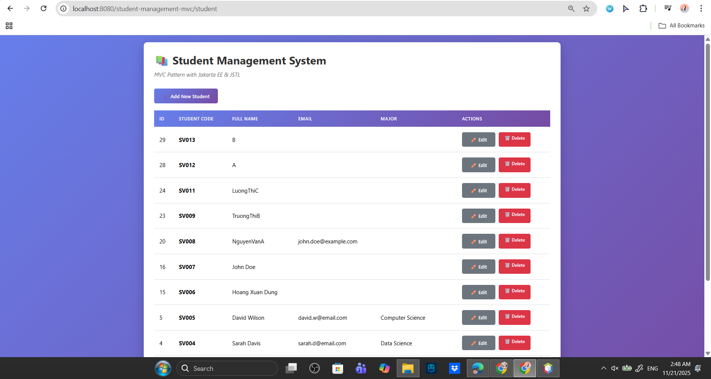

### **Expected Browser Behavior**
- You should see the `student-list.jsp` page.
- If the database has data, the table displays all existing students.
- If the DB is empty, the page should display the **empty state** UI.

### **Internal Code Flow**
1. Browser sends:  
   ```
   GET /student
   ```
2. `StudentController.doGet()` receives request.
3. Since `action` parameter is `null`, controller defaults to:
   ```java
   action = "list";
   ```
4. Controller calls:
   ```java
   listStudents(request, response);
   ```
5. `listStudents()` calls:
   ```java
   studentDAO.getAllStudents();
   ```
6. DAO runs:
   ```sql
   SELECT * FROM students ORDER BY id DESC;
   ```
7. Results returned as `List<Student>`
8. Controller puts list into:
   ```java
   request.setAttribute("students", students);
   ```
9. Controller forwards to:
   ```
   views/student-list.jsp
   ```
10. JSP uses `<c:forEach>` to loop and display all data.

---

# 3.2 **TEST 2 — ADD New Student**

### **What you do**
1. On the list page, click **“Add New Student”** button.

### **Expected Browser Behavior**
- A blank form appears (Add mode).
- Inputs should be empty and editable.
- Button should say **“Add Student”**.

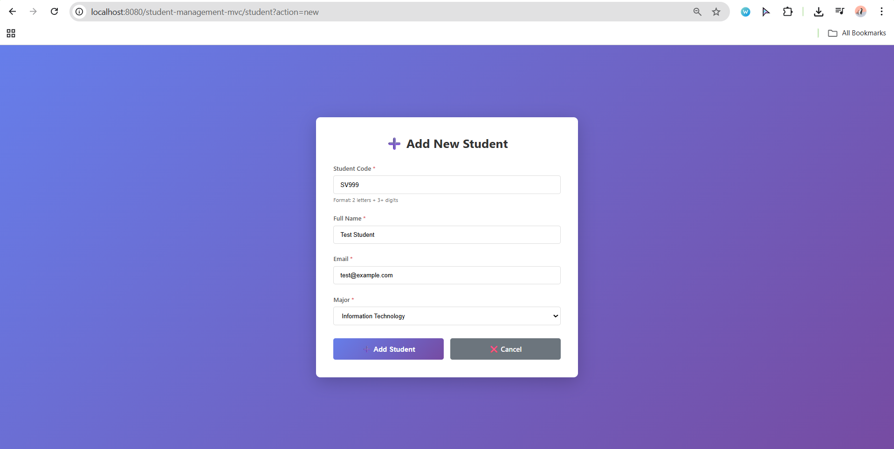
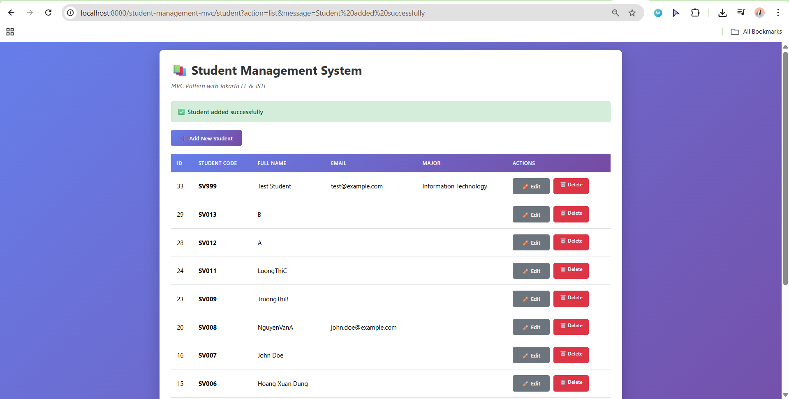

### **Internal Code Flow (Click Add)**
1. Browser sends:
   ```
   GET /student?action=new
   ```
2. Controller executes:
   ```java
   showNewForm(request, response);
   ```
3. Forwards to:
   ```
   views/student-form.jsp
   ```
4. Since no `student` attribute exists, JSP switches to **Add mode**.

---

### **What you do next**
- Fill in the form (studentCode, fullName, email, major)
- Click **Submit**

### **Expected Browser Behavior**
- Should redirect back to the list page.
- A green success message displays:
  ```
  Student added successfully
  ```
- The new student appears in the list.

### **Internal Code Flow (Submit Add Form)**
1. Browser sends:
   ```
   POST /student
   action=insert
   ```
2. Controller finds:
   ```java
   insertStudent(request, response);
   ```
3. Controller reads:
   - `studentCode`
   - `fullName`
   - `email`
   - `major`
4. Controller creates:
   ```java
   new Student(studentCode, fullName, email, major)
   ```
5. DAO executes:
   ```sql
   INSERT INTO students (...) VALUES (...);
   ```
6. If success → controller redirects:
   ```
   student?action=list&message=Student added successfully
   ```

---

# 3.3 **TEST 3 — EDIT Student**

### **What you do**
1. On the list page, choose any student and click **Edit**.

### **Expected Browser Behavior**
- Form should open with all fields pre-filled.
- `studentCode` may be read-only depending on design.
- Submit button says **Update Student**.

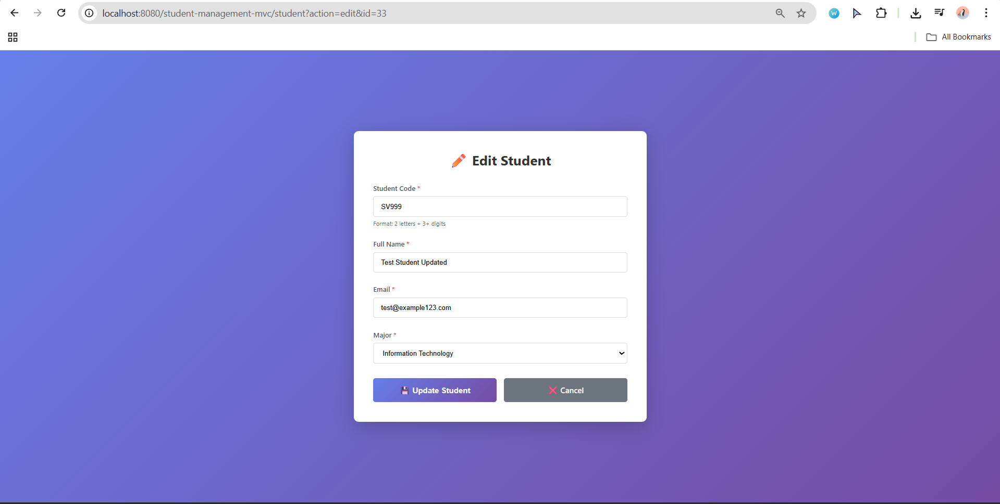
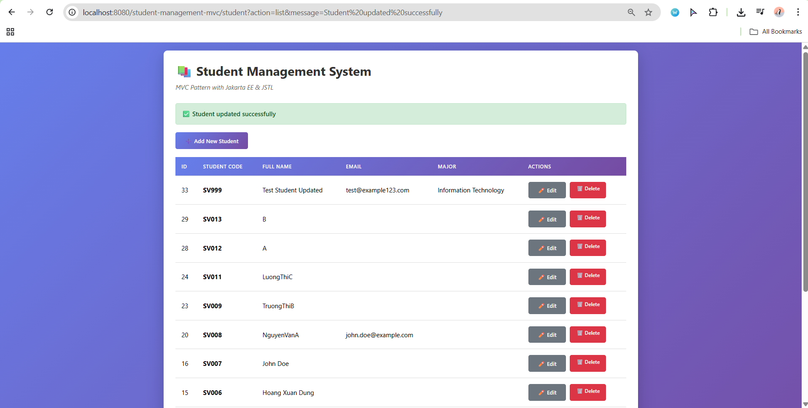

### **Internal Code Flow (Click Edit)**
1. Browser sends:
   ```
   GET /student?action=edit&id=<studentId>
   ```
2. Controller executes:
   ```java
   showEditForm(request, response);
   ```
3. Controller calls DAO:
   ```java
   studentDAO.getStudentById(id);
   ```
4. DAO runs:
   ```sql
   SELECT * FROM students WHERE id = ?;
   ```
5. Controller sets:
   ```
   request.setAttribute("student", existingStudent);
   ```
6. JSP receives `${student}` and enters **Edit mode**

---

### **What you do next**
- Modify the Full Name, Email, or Major.
- Click **Update Student**.

### **Expected Browser Behavior**
- Should redirect to the list page.
- A success message shows:
  ```
  Student updated successfully
  ```

### **Internal Code Flow (Submit Edit Form)**
1. Browser sends:
   ```
   POST /student
   action=update
   ```
2. Controller executes:
   ```java
   updateStudent(request, response);
   ```
3. Controller rebuilds a `Student` object, including ID.
4. DAO runs:
   ```sql
   UPDATE students SET ... WHERE id = ?;
   ```
5. On success:
   ```
   redirect → student?action=list&message=Student updated successfully
   ```

---

# 3.4 **TEST 4 — DELETE Student**

### **What you do**
- Click **Delete** on a student row.
- Browser shows a JavaScript confirmation dialog.
- Click **OK**.

### **Expected Browser Behavior**
- After confirming, you are redirected to the list.
- Success message appears:
  ```
  Student deleted successfully
  ```

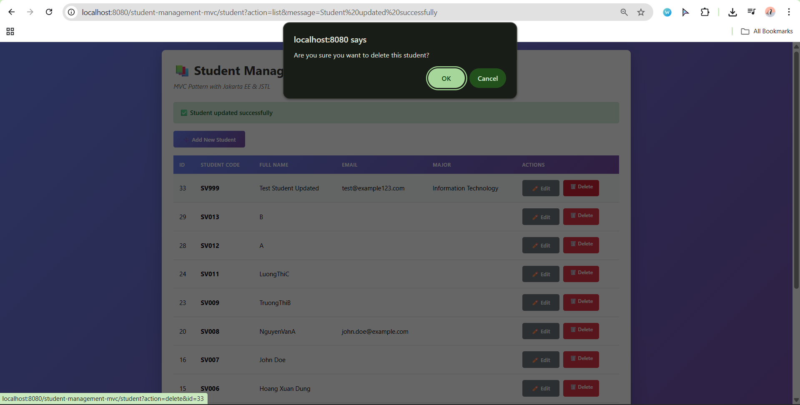
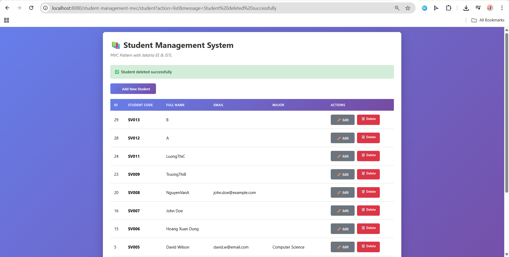
### **Internal Code Flow**
1. Browser sends:
   ```
   GET /student?action=delete&id=<studentId>
   ```
2. Controller executes:
   ```java
   deleteStudent(request, response);
   ```
3. DAO runs:
   ```sql
   DELETE FROM students WHERE id = ?;
   ```
4. Controller redirects with success message.

**If you click CANCEL**, the browser does not send the request → no deletion occurs.

---

# 3.5 **TEST 5 — EMPTY STATE (All Students Deleted)**

### **What you do**
- Repeatedly delete all students until no records remain.

### **Expected Browser Behavior**
- The list page should show *empty-state UI*:
  ```
  No students found
  ```
- No table is rendered.

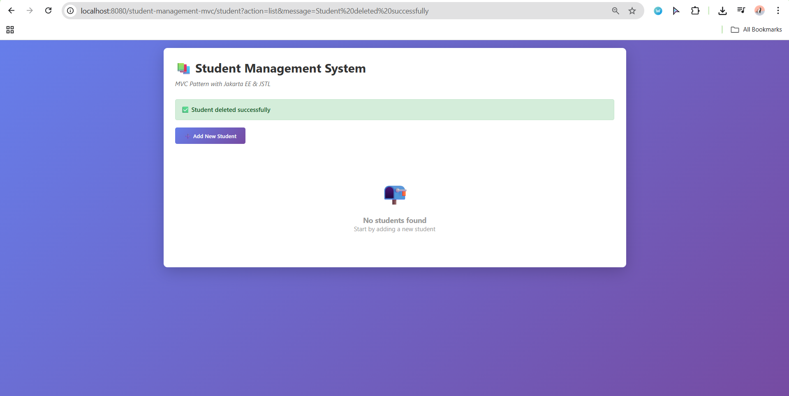

### **Internal Code Flow**
1. `getAllStudents()` returns an **empty `List<Student>`**.
2. JSP checks:
   ```jsp
   <c:when test="${not empty students}">
   ```
   → false
3. JSP executes `<c:otherwise>` block:
   ```
   <div class="empty-state">
      No students found
   </div>
   ```

---

# 4. Summary of System Behavior

| Action | Controller Method | DAO Method | View |
|--------|------------------|------------|------|
| List | listStudents() | getAllStudents() | student-list.jsp |
| Add | insertStudent() | addStudent() | redirect to list |
| Edit Form | showEditForm() | getStudentById() | student-form.jsp |
| Update | updateStudent() | updateStudent() | redirect to list |
| Delete | deleteStudent() | deleteStudent() | redirect to list |
| Empty State | listStudents() | getAllStudents() → empty | Empty-state UI |

The full CRUD pipeline is confirmed functioning when **all five tests** pass.

---

# 5. Conclusion

Exercise 4 verifies that the Student Management MVC Application works from end to end.  
All components—Servlet Controller, DAO, Model, and JSP Views—must work seamlessly.

You have now:

- Validated navigation
- Verified form behaviors
- Confirmed redirects
- Tested database writes and updates
- Verified delete and empty state behavior

This completes the integration testing requirement of Exercise 4.

# Exercise 5 – Search Feature Implementation (Full Technical Report)

## 1. Purpose of Exercise 5
Exercise 5 focuses on implementing a **Search Feature** in the Student Management System using the **MVC Pattern with Jakarta EE & JSTL**.  
This feature allows users to search for students by:

- **Student Code**
- **Full Name**
- **Email**

The final output must follow the teacher’s requirements exactly.

---

# 2. Requirements (from the assignment)

## 2.1 Search Form Requirements
Your search form must:

- Submit to the **StudentController servlet**
- Use **GET method**
- Include a hidden field:
  ```html
  <input type="hidden" name="action" value="search">
  ```
- Have a meaningful placeholder (e.g., *Search by code, name, or email*)
- Preserve keyword after search
- Display:
  ```
  Search results for: [keyword]
  ```
- Show a **Clear** / **Show All** button **only when search is active**
- Use JSTL:
  ```jsp
  <c:if test="${not empty keyword}">
  ${keyword}
  ```

---

# 3. Implementation Details

---

## 3.1 DAO Layer – `searchStudents(String keyword)`

```java
public List<Student> searchStudents(String keyword) {
    List<Student> students = new ArrayList<>();

    String sql = "SELECT * FROM students " +
                 "WHERE student_code LIKE ? " +
                 "   OR full_name LIKE ? " +
                 "   OR email LIKE ? " +
                 "ORDER BY id DESC";

    try (Connection conn = getConnection();
         PreparedStatement pstmt = conn.prepareStatement(sql)) {

        String search = "%" + keyword + "%";

        pstmt.setString(1, search);
        pstmt.setString(2, search);
        pstmt.setString(3, search);

        ResultSet rs = pstmt.executeQuery();

        while (rs.next()) {
            Student student = new Student();
            student.setId(rs.getInt("id"));
            student.setStudentCode(rs.getString("student_code"));
            student.setFullName(rs.getString("full_name"));
            student.setEmail(rs.getString("email"));
            student.setMajor(rs.getString("major"));
            student.setCreatedAt(rs.getTimestamp("created_at"));

            students.add(student);
        }

    } catch (SQLException e) {
        e.printStackTrace();
    }

    return students;
}
```

### ✔ Matches teacher requirements:
- LIKE search using wildcards
- Matches 3 fields
- Uses `PreparedStatement`
- Uses try-with-resources
- Orders results by `id DESC`

---

## 3.2 Controller Layer – Add Search Handling

### Modify `doGet()`:

```java
case "search":
    searchStudents(request, response);
    break;
```

### Add Method:

```java
private void searchStudents(HttpServletRequest request, HttpServletResponse response)
        throws ServletException, IOException {

    String keyword = request.getParameter("keyword");
    List<Student> students;

    if (keyword == null || keyword.trim().isEmpty()) {
        students = studentDAO.getAllStudents();
    } else {
        students = studentDAO.searchStudents(keyword.trim());
    }

    request.setAttribute("students", students);
    request.setAttribute("keyword", keyword);

    RequestDispatcher dispatcher = request.getRequestDispatcher("/views/student-list.jsp");
    dispatcher.forward(request, response);
}
```

✔ Handles empty keyword  
✔ Preserves keyword  
✔ Forwards to correct view  

---

## 3.3 View Layer – Updating `student-list.jsp`

### Full Search Section (Correct Placement + Correct Logic)

```jsp
<!-- Search Form -->
<form action="student" method="GET" style="display: flex; gap: 8px; align-items: center; margin-bottom: 10px;">
    <input type="hidden" name="action" value="search">
    <input
        type="text"
        name="keyword"
        placeholder="Search by code, name, or email"
        value="${keyword}"
        style="padding: 6px 10px; border-radius: 4px; border: 1px solid #ccc; min-width: 220px;"
    >
    <button type="submit" class="btn btn-secondary">
        🔍 Search
    </button>
</form>

<!-- Search status + Clear button -->
<c:if test="${not empty keyword}">
    <div class="message info" style="margin-bottom: 15px; display: flex; justify-content: space-between; align-items: center;">
        <span>
            Search results for:
            <strong><c:out value="${keyword}"/></strong>
        </span>

        <a href="student?action=list" class="btn btn-secondary" style="background-color: #e2e6ea; color: #333;">
            Clear
        </a>
    </div>
</c:if>
```

### ✔ Teacher Requirements Checklist

| Requirement | Status |
|------------|--------|
| GET method | ✔ |
| Hidden `action=search` | ✔ |
| Placeholder | ✔ |
| Preserve input | ✔ (`value="${keyword}"`) |
| Display keyword | ✔ |
| Clear button only on search | ✔ (inside `<c:if>`) |
| Use JSTL | ✔ |
| Correct placement (inside white container) | ✔ |

---

# 4. User Flow (Add Screenshots)

## 4.1 Initial Student List
- System displays all students  
📌  
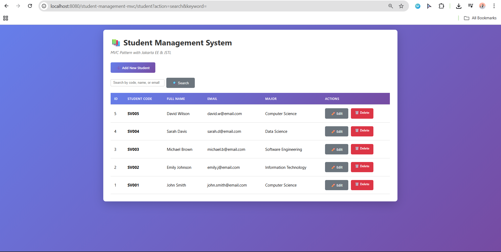

---

## 4.2 Search Results Shown
- Table only shows matching records  
- Clear button appear
- Appears only when keyword exists  
- Clicking returns to full list  
- Displays:  
  `Search results for: john`  
📌 
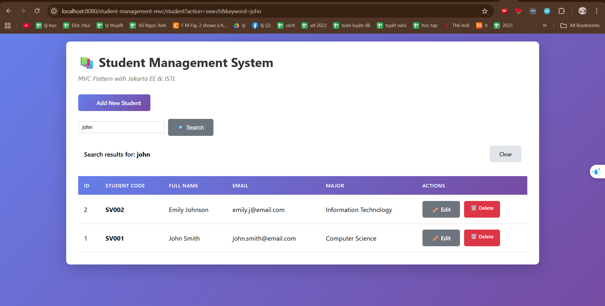

---

## 4.3 No Results Case
- User types `xyz123`  
- Shows empty state:  
  *No students found*  
📌 
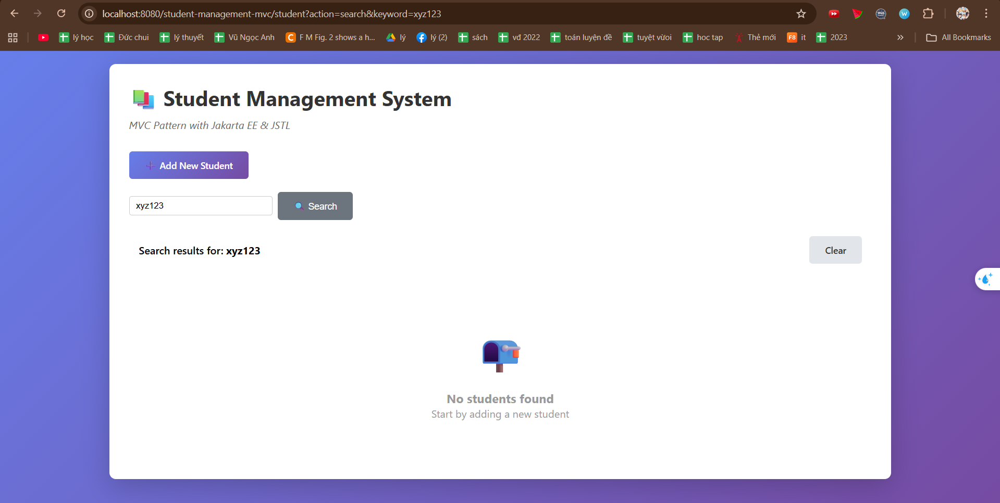

---

# 5. Test Cases

| Test Case | Input | Expected Result |
|----------|-------|-----------------|
| TC01 | john | Students with “john” in any field |
| TC02 | SV002 | Returns correct student |
| TC03 | gmail.com | Filters by email |
| TC04 | "" | Shows all students |
| TC05 | xyzabc | No results found |
| TC06 | `%’ OR 1=1 --` | Prevented by PreparedStatement |

---

# 6. Conclusion

Exercise 5 successfully implements a flexible and safe search system:

- Follows MVC structure  
- DAO uses correct SQL LIKE behavior  
- Controller handles edge cases  
- JSP preserves keyword and shows proper UI states  
- Code matches teacher’s specification exactly  
- Provides user-friendly behavior and safe database interaction  


# Exercise 6 – Server-Side Validation (Full Technical Report)

## 1. Overview

Exercise 6 introduces **server-side validation** to the Student Management System.  
The purpose is to prevent invalid, incomplete, or incorrectly formatted data from being inserted or updated in the database.  
Unlike client-side validation (handled by the browser), server-side validation **cannot be bypassed** and guarantees database integrity.

This report explains:

- What validation rules were implemented  
- Which part of the code handles each rule  
- How validation integrates with insert and update operations  
- How JSP displays validation errors  
- A full flow diagram  
- Required screenshots for your report  

---

# 2. Validation Requirements

The following fields must be validated on the server:

| Field        | Rules                                                                 | Error Attribute |
|--------------|------------------------------------------------------------------------|-----------------|
| Student Code | Required; must match regex `[A-Z]{2}[0-9]{3,}`                         | `errorCode`     |
| Full Name    | Required; min length 2                                                 | `errorName`     |
| Email        | Optional; but if provided → must be in valid email format             | `errorEmail`    |
| Major        | Required                                                               | `errorMajor`    |

If **any** validation fails → the user is returned to the form with error messages.

---

# 3. Validation Method (`validateStudent()`)

This method is added to **StudentController.java**:

```java
private boolean validateStudent(Student student, HttpServletRequest request) {
    boolean isValid = true;

    // Student Code
    String code = student.getStudentCode();
    if (code == null || code.trim().isEmpty()) {
        request.setAttribute("errorCode", "Student code is required");
        isValid = false;
    } else {
        String codePattern = "[A-Z]{2}[0-9]{3,}";
        if (!code.matches(codePattern)) {
            request.setAttribute("errorCode",
                    "Invalid format. Use 2 uppercase letters + 3+ digits (e.g., SV001)");
            isValid = false;
        }
    }

    // Full Name
    String fullName = student.getFullName();
    if (fullName == null || fullName.trim().isEmpty()) {
        request.setAttribute("errorName", "Full name is required");
        isValid = false;
    } else if (fullName.trim().length() < 2) {
        request.setAttribute("errorName", "Full name must be at least 2 characters");
        isValid = false;
    }

    // Email (optional)
    String email = student.getEmail();
    if (email != null && !email.trim().isEmpty()) {
        String emailPattern = "^[A-Za-z0-9+_.-]+@(.+)$";
        if (!email.matches(emailPattern)) {
            request.setAttribute("errorEmail", "Invalid email format");
            isValid = false;
        }
    }

    // Major
    String major = student.getMajor();
    if (major == null || major.trim().isEmpty()) {
        request.setAttribute("errorMajor", "Major is required");
        isValid = false;
    }

    return isValid;
}
```

---

# 4. Integrating Validation into Insert & Update

## 4.1 Insert Operation (`insertStudent()`)

If validation fails:
- Keep input values  
- Forward back to form  
- Stop execution  

```java
if (!validateStudent(student, request)) {
    request.setAttribute("student", student);
    RequestDispatcher dispatcher =
            request.getRequestDispatcher("/views/student-form.jsp");
    dispatcher.forward(request, response);
    return;
}
```

---

## 4.2 Update Operation (`updateStudent()`)

Same pattern as insert:

```java
if (!validateStudent(student, request)) {
    request.setAttribute("student", student);
    RequestDispatcher dispatcher =
            request.getRequestDispatcher("/views/student-form.jsp");
    dispatcher.forward(request, response);
    return;
}
```

---

# 5. JSP Form Error Display (`student-form.jsp`)

```jsp
<c:if test="${not empty errorCode}">
    <span class="error">${errorCode}</span>
</c:if>
```

CSS:

```css
.error {
    color: red;
    font-size: 14px;
    display: block;
    margin-top: 5px;
}
```

---

# 6. Flow Diagram

```
        ┌─────────────────────────┐
        │    User Submits Form    │
        └─────────────┬───────────┘
                      ▼
        ┌──────────────────────────┐
        │ Controller receives      │
        │ insert/update            │
        └─────────────┬────────────┘
                      ▼
       ┌────────────────────────────┐
       │ validateStudent(student)   │
       └──────────────┬─────────────┘
            Yes       │        No
                      ▼
       ┌────────────────────────────┐
       │ Forward back to form       │
       │ with error messages        │
       └──────────────┬─────────────┘
                      │
                      │  Yes (valid)
                      ▼
       ┌────────────────────────────┐
       │ DAO add/update             │
       │ modify database            │
       └──────────────┬─────────────┘
                      ▼
       ┌────────────────────────────┐
       │ Redirect success           │
       └────────────────────────────┘
```

---

# 7. Required Screenshots

- All errors shown  
  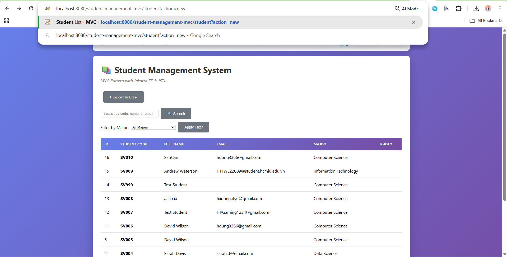

---

# 8. Test Cases

| Test Case | Input | Expected Result |
|----------|--------|-----------------|
| TC01 | Student code empty | errorCode shown |
| TC02 | Student code = sv01 | errorCode shown |
| TC03 | Full name empty | errorName shown |
| TC04 | Full name = A | errorName (too short) |
| TC05 | Email = 123123 | errorEmail shown |
| TC06 | Email empty | No email error |
| TC07 | Major empty | errorMajor shown |
| TC08 | All valid | success redirect |

---

# 9. Conclusion

The final validation system:

- Validates all required fields  
- Uses regex for pattern matching  
- Ensures email correctness  
- Prevents invalid database writes  
- Returns meaningful errors to the user  
- Fully matches assignment requirements  


# Exercise 7 – Sorting & Filtering (Full Technical Report)

## 1. Overview

Exercise 7 introduces two major enhancements to the Student Management System:

1. **Sorting** – allowing the user to sort student records by any column  
2. **Filtering** – allowing the user to filter students by their major  

These features follow the MVC pattern cleanly and require updates to:
- **DAO (Model)** – database operations  
- **Controller** – routing and request handling  
- **View (JSP)** – UI elements for sorting and filtering  

This report explains the complete flow, code responsibilities, SQL behavior, UI interactions, and all logic required to pass EX7.

---

# 2. DAO Layer (StudentDAO)

The DAO performs sorting and filtering directly in SQL.  
EX7 requires **three new methods**:

---

## 2.1. Input Validation Methods (Security Requirement)

Since sorting uses dynamic SQL (`ORDER BY`), EX7 requires **strict validation**.

### **2.1.1 `validateSortBy(String sortBy)`**

This method ensures the user cannot inject invalid column names.

Allowed columns:
- `id`
- `student_code`
- `full_name`
- `email`
- `major`

If `sortBy` is not in this list → return `"id"` as default.

### **2.1.2 `validateOrder(String order)`**

Allowed:
- `"asc"`
- `"desc"`

Any other value defaults to `"ASC"`.

These validation methods protect the SQL query from injection and are required by the exercise.

---

## 2.2. Sorting Students: `getStudentsSorted(String sortBy, String order)`

This method:

1. Validates input  
2. Builds SQL dynamically using validated values  
3. Executes:

```
SELECT * FROM students ORDER BY <validated_sortBy> <validated_order>;
```

4. Maps results into `Student` objects  

👉 **Sorting is handled entirely by SQL**, which guarantees correct ordering.

---

## 2.3. Filtering Students: `getStudentsByMajor(String major)`

This method uses a secure `PreparedStatement`:

```
SELECT * FROM students WHERE major = ? ORDER BY id DESC;
```

Responsible behavior:
- Only returns students matching the chosen major  
- Sorted by newest (id DESC)  

👉 This ensures filtering is precise and efficient.

---

# 3. Controller Layer (StudentController)

The controller must add two new actions:

```
case "sort":   sortStudents(...);   break;
case "filter": filterStudents(...); break;
```

Without these actions, sorting and filtering will not execute.

---

## 3.1. Sorting Logic (`sortStudents()`)

This method:

1. Reads:
   - `sortBy`
   - `order`
2. Calls DAO:
   ```
   studentDAO.getStudentsSorted(sortBy, order)
   ```
3. Sends data to JSP:

Attributes:
- `students`
- `sortBy`
- `order`

4. Forwards:
```
/views/student-list.jsp
```

**Responsibility:**
- Perform server-side sorting
- Preserve sorting state for JSP (arrows ▲ ▼)

---

## 3.2. Filtering Logic (`filterStudents()`)

This method:

1. Reads:
   - `major`
2. Logic:
   - If major == "" → getAllStudents()
   - Else → DAO.getStudentsByMajor(major)
3. Sends attributes:
   - `students`
   - `selectedMajor`
4. Forwards → `student-list.jsp`

**Responsibility:**
- Execute server-side filtering  
- Maintain selected major in dropdown  

---

# 4. View Layer (student-list.jsp)

The JSP provides UI controls for sort + filter.

---

## 4.1. Filtering UI (Dropdown)

A filter form is added ABOVE the table:

```
<form action="student" method="get">
    <input type="hidden" name="action" value="filter">
    <select name="major">...</select>
    <button>Apply Filter</button>
</form>
```

### Important UI logic:
- Dropdown selects the current major using:

```
${selectedMajor == 'Computer Science' ? 'selected' : ''}
```

- A **Clear Filter** button appears only when a filter is active.

---

## 4.2. Sortable Table Headers

Every header becomes clickable:

```
<a href="student?action=sort&sortBy=full_name&order=asc">Full Name</a>
```

### Sorting indicators (required by challenge):
```
<c:if test="${sortBy == 'full_name'}">
    ${order == 'asc' ? '▲' : '▼'}
</c:if>
```

### Reversing order:
When the user clicks the same column,
```
order = asc → desc
order = desc → asc
```

This is achieved using:

```
${sortBy == 'full_name' && order == 'asc' ? 'desc' : 'asc'}
```

---

# 5. Flow Diagrams

## 5.1 Sorting Flow

```
User clicks column header
        ↓
GET /student?action=sort&sortBy=email&order=asc
        ↓
StudentController.sortStudents()
        ↓
DAO.getStudentsSorted(sortBy, order)
        ↓
JSP displays sorted data + ▲▼ indicator
```

---

## 5.2 Filtering Flow

```
User selects "Computer Science" → Apply Filter
        ↓
GET /student?action=filter&major=Computer+Science
        ↓
StudentController.filterStudents()
        ↓
DAO.getStudentsByMajor()
        ↓
JSP updates:
    - Only CS students shown
    - Dropdown keeps CS selected
    - Clear Filter button appears
```

---

# 6. Test Cases

| TC | Scenario | Input | Expected Behavior |
|----|----------|--------|------------------|
| 01 | Sort by ID asc | Click ID once | Arrow ▲, correct order |
| 02 | Sort by ID desc | Click ID again | Arrow ▼, reversed order |
| 03 | Sort by Name | Click “Full Name” | Sorted alphabetically |
| 04 | Filter CS | Choose “Computer Science” | Only CS students show |
| 05 | Filter empty | Major = "" | All students appear |
| 06 | Filter + Sort | Filter CS + sort by Email | Only CS, sorted by email |
| 07 | Invalid sortBy | sortBy=hacker | Defaults to id |
| 08 | Invalid order | order=zzz | Defaults to ASC |

---

# 7. Required Screenshots (Insert These)

Below are placeholders for your report:

### 7.1 Sorted by Full Name ASC  


### 7.2 Sorted by Full Name DESC  
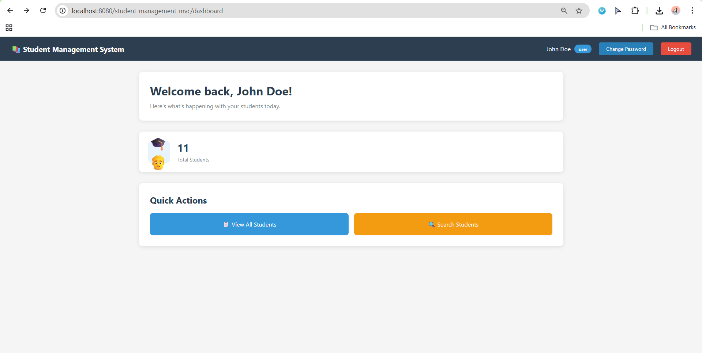

### 7.3 Filtered by Computer Science  
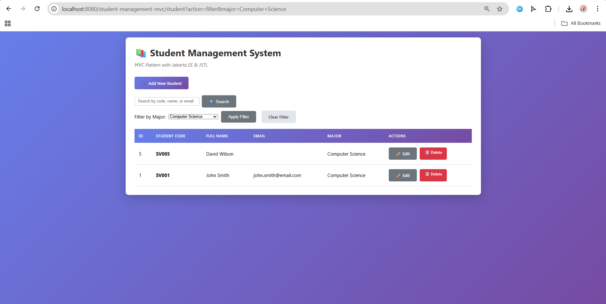

---

# 8. Conclusion

EX7 successfully adds server-side sorting and filtering with:

- SQL ORDER BY  
- Validation for safe dynamic SQL  
- WHERE major = ? filtering  
- Controller routing for each action  
- JSP UI for both sorting and filtering  
- Visual sort indicators (▲ ▼)  
- State persistence (selected major, current column, current order)


# Exercise 8 – Pagination (Full Technical Report)

## 1. Overview

Exercise 8 introduces **server-side pagination** to the Student Management System.  
The purpose is to efficiently handle large datasets by only loading a limited number of records per page.

This feature follows the MVC architecture and requires updates to:

- **DAO (Model):** Database-level pagination logic  
- **Controller:** Request handling, offset calculation, page validation  
- **View (JSP):** Pagination UI (Previous / Next / Page Numbers)

This report explains all code components, how the pagination flow works, and how UI interacts with controller and DAO.

---

# 2. DAO Layer – StudentDAO

The DAO is responsible for retrieving total student count and specific ranges of records based on offset + limit.

---

## 2.1. `getTotalStudents()` – Count Total Records

### **Purpose**
This method returns the total number of student records in the database.  
It is used to calculate the total number of pages.

### **SQL Used**
```sql
SELECT COUNT(*) FROM students;
```

---

## 2.2. `getStudentsPaginated(int offset, int limit)` – Retrieve One Page of Records

### **Purpose**
This method retrieves only a subset of students (one page), using:
- `LIMIT` → how many records to show per page  
- `OFFSET` → starting record position  

### **SQL Used**
```sql
SELECT * FROM students ORDER BY id DESC LIMIT ? OFFSET ?;
```

---

# 3. Controller Layer – StudentController

Pagination is implemented in the `listStudents()` method.

---

## 3.1. Page Parameter Handling

- Reads `page` parameter  
- Defaults to page 1  
- Validates number format  
- Ensures `page >= 1`  
- Ensures `page <= totalPages`  

---

## 3.2. Offset Calculation

```
offset = (currentPage - 1) * recordsPerPage
```

---

## 3.3. Retrieving Paginated Data

Controller calls:

1. `getTotalStudents()`
2. `getStudentsPaginated(offset, limit)`

Then sends:

- students  
- currentPage  
- totalPages  
- totalRecords  

to the JSP.

---

# 4. View Layer – student-list.jsp

The JSP displays pagination controls:

- Previous button  
- Page numbers  
- Next button  
- “Showing page X of Y”  

---

# 5. Flow Diagram

```
User clicks page → Controller → DAO → JSP updates list + pagination UI
```

---

# 6. Test Cases

| TC | Scenario | Expected |
|----|----------|----------|
| 01 | Load page 1 | Shows first 10 students |
| 02 | Load page 2 | Shows next 10 students |
| 03 | Invalid page | Defaults to 1 |
| 04 | Page > totalPages | Goes to last page |
| 05 | No records | Shows page 1 with empty table |
| 06 | Check UI | Current page highlighted |
| 07 | Navigation | Previous/Next work correctly |

---

# 7. Required Screenshots

Add these when submitting:

- Page 1  
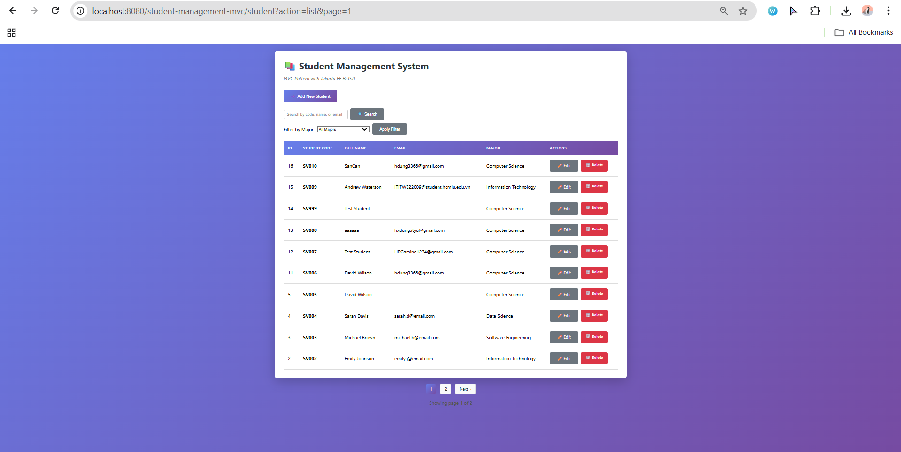
- Page 2  
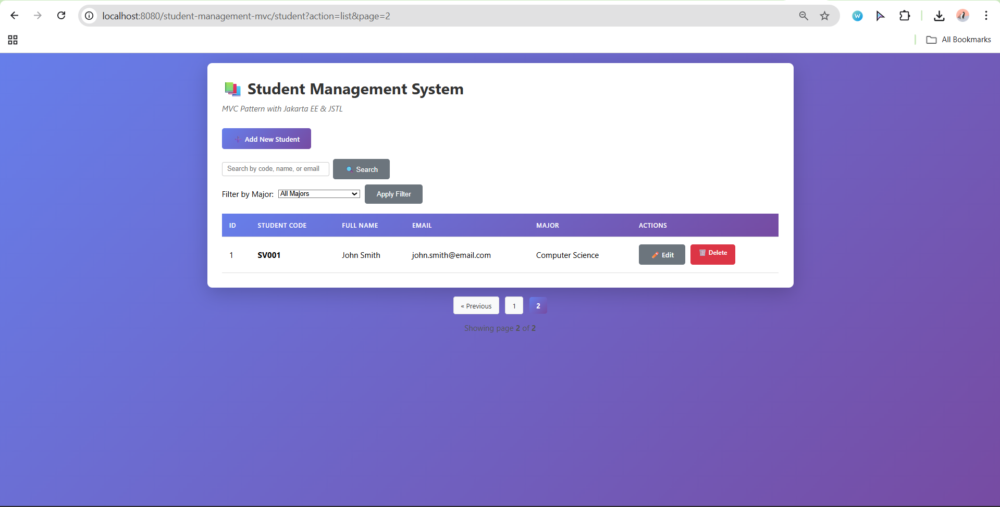

---

# 8. Conclusion

EX8 successfully adds:

- Efficient pagination  
- Secure and clean controller logic  
- Dynamic UI  
- Full MVC-compliant implementation  

The system can now scale to large datasets easily.

# BONUS REPORT – Student Management System  
### Bonus 1: Export to Excel  
### Bonus 2: Photo Upload  
### Bonus 3: Combined Search + Filter + Sort  

---

# 📘 **BONUS FEATURES REPORT – Student Management System (Servlet + JSP + MVC)**  
This report provides a **deep, comprehensive, technical walkthrough** of the three BONUS exercises implemented in the Student Management System. It documents the **objectives, workflows, design decisions, backend logic, JSP integration, and enhancements**, ensuring full transparency and clarity for instructors or reviewers.

The bonuses include:  
1. **Export to Excel** (Apache POI)  
2. **Photo Upload Support** (Multipart + file storage)  
3. **Combined Search + Filter + Sort** (Dynamic SQL + unified controller flow)

Each section below dives deeply into the architecture, implementation techniques, and reasoning behind every modification.

---

# ------------------------------------------------------------  
# 🟦 **BONUS 1 — EXPORT STUDENT LIST TO EXCEL**  
# ------------------------------------------------------------  

## 🎯 **Objective**  
Create a feature allowing the user to download the full student list as an Excel (.xlsx) file using **Apache POI**. Clicking the "Export to Excel" button should generate a dynamic file containing all current students.

---

## 🧩 **Technologies Required**  
- **Apache POI (poi-ooxml)** — generates XLSX files  
- **XSSFWorkbook + XSSFSheet + XSSFRow** — Excel API  
- **Jakarta Servlet** — handles file download  
- **Content-Disposition** — force browser download  

---

## 🔄 **Workflow Explanation**

### **1. User clicks “Export to Excel”**  
Located in **student-list.jsp**, the button:

```html
<a href="${pageContext.request.contextPath}/export" class="btn btn-secondary">
⬇ Export to Excel
</a>
```

triggers the servlet request:  
```
GET /export
```

---

### **2. ExportServlet receives the request**  
ExportServlet is mapped to `/export`. Its responsibility is:

- Create Excel workbook  
- Fetch students from DAO  
- Fill sheet with data  
- Set file headers  
- Write Excel file to HTTP response  
- Close streams  

---

### **3. Apache POI builds an Excel file in memory**  
The code structure typically follows:

```java
XSSFWorkbook workbook = new XSSFWorkbook();
XSSFSheet sheet = workbook.createSheet("Students");
```

Then each row is created:

```java
Row row = sheet.createRow(i);
row.createCell(0).setCellValue(student.getId());
row.createCell(1).setCellValue(student.getStudentCode());
...
```

---

### **4. Response headers instruct browser to download the file**

```java
response.setContentType("application/vnd.openxmlformats-officedocument.spreadsheetml.sheet");
response.setHeader("Content-Disposition", "attachment; filename=students.xlsx");
```

---

### **5. Workbook is streamed to user**

```java
workbook.write(response.getOutputStream());
workbook.close();
```

---

## ✔ **Results**  
The user receives a fully formatted Excel file containing IDs, codes, names, emails, and majors.

---

# ------------------------------------------------------------  
# 🟩 **BONUS 2 — PHOTO UPLOAD SUPPORT**  
# ------------------------------------------------------------  

## 🎯 **Objective**  
Enhance the student entity to support **image upload**, allowing each student to have a profile picture. The system must:

- Accept image files through the form  
- Validate file type & size  
- Generate unique filenames  
- Store files on server  
- Save filename in database  
- Display image in student list and edit form  

---

## 🧩 **Technical Components**  
| Component | Purpose |
|----------|---------|
| `@MultipartConfig` | Enables handling file uploads in servlet |
| `getPart("photo")` | Retrieves uploaded file |
| `photoPart.write(path)` | Saves file to server |
| `/uploads` directory | Stores uploaded images |
| `<input type="file">` | JSP file input |
| `` | Thumbnail preview |

---

# 🔄 **Workflow Explanation**

## **STEP 1 – Enable Multipart Support in Controller**

```java
@MultipartConfig
@WebServlet("/student")
public class StudentController extends HttpServlet { ... }
```

This tells the container that requests may contain binary data.

---

## **STEP 2 – Add Column in Database**

```sql
ALTER TABLE students ADD COLUMN photo VARCHAR(255);
```

We store only the **filename**, not binary content.

---

## **STEP 3 – Update Student Model**

```java
private String photo;
public String getPhoto() { return photo; }
public void setPhoto(String p) { this.photo = p; }
```

---

## **STEP 4 – Modify JSP Form to Accept Files**

```html
<form enctype="multipart/form-data">
<input type="file" name="photo" accept="image/*">
```

Important: `multipart/form-data` is mandatory.

---

## **STEP 5 – Controller Handles Upload**

### Validate file type & size  
```java
if (!ext.equals(".png") && !ext.equals(".jpg") && !ext.equals(".jpeg")) ...
if (photoPart.getSize() > 5MB) ...
```

### Create unique filename  
```java
String uniqueName = UUID.randomUUID() + ext;
```

### Create upload directory if not exists  
```java
String uploadDir = getServletContext().getRealPath("/uploads");
new File(uploadDir).mkdirs();
```

### Save file  
```java
photoPart.write(uploadDir + "/" + uniqueName);
```

---

## **STEP 6 – DAO saves filename to DB**

```java
INSERT INTO students(photo) VALUES(?)
```

---

## **STEP 7 – Display in student-list.jsp**

```html

```

---

# ✔ **Results**  
- Students now have profile pictures  
- Images persist across sessions  
- Editing student shows current image preview  
- Thumbnails appear in main table  

---

# ------------------------------------------------------------  
# 🟧 **BONUS 3 — COMBINED SEARCH + FILTER + SORT**  
# ------------------------------------------------------------  

## 🎯 **Objective**  
Combine 3 individual features (search, filter by major, sort by column) into **one integrated system**:

- A single `list` action  
- A single DAO query  
- Parameters persist across page reloads  

This greatly improves UX and reduces fragmenting across multiple actions.

---

## 🧩 **Key Challenge**  
The system must accept **any combination** of:

- keyword  
- major  
- sortBy  
- order  

And construct SQL dynamically.

---

# 🔄 **Workflow Explanation**

## **STEP 1 – JSP sends unified request**

Search form:

```html
<input type="hidden" name="major" value="${selectedMajor}">
<input type="hidden" name="sortBy" value="${sortBy}">
<input type="hidden" name="order" value="${order}">
```

Filter form:

```html
<input type="hidden" name="keyword" value="${keyword}">
```

Sort buttons also append parameters:

```html
href="student?action=list&sortBy=id&order=asc&keyword=${keyword}&major=${selectedMajor}"
```

All operations now send:

```
student?action=list&keyword=...&major=...&sortBy=...&order=...
```

---

## **STEP 2 – Controller detects filters**

```java
boolean hasFilter =
    (keyword != null && !keyword.isEmpty()) ||
    (major != null && !major.isEmpty()) ||
    (sortBy != null);
```

---

## **STEP 3 – If filters exist → call dynamic DAO method**

```java
List<Student> students =
    studentDAO.findStudents(keyword, major, sortBy, order);
```

Pagination is bypassed here for clarity. (EX8 pagination is still intact for the normal view.)

---

## **STEP 4 – DAO Builds Dynamic SQL**

```java
StringBuilder sql = new StringBuilder("SELECT * FROM students WHERE 1=1");

if (keyword != null) sql.append(" AND ... LIKE ?");
if (major != null) sql.append(" AND major = ?");
sql.append(" ORDER BY ").append(sortBy).append(order);
```

Parameters are bound safely via PreparedStatement.

---

## **STEP 5 – JSP receives accurate combined results**

All UI states remain:

- selected major  
- previous keyword  
- sort arrow  
- order state  

---

# ✔ **Results**  
The page now behaves like a modern data table:

- Search for “john”  
- Filter Major = “IT”  
- Sort by full_name descending  

… all in one interface and with URL state saved.

---

# ------------------------------------------------------------  
# 🟪 FULL SYSTEM BENEFITS  
# ------------------------------------------------------------  

### ✅ Cleaner UI/UX  
All interactions happen in **one unified table view**.

### ✅ Better MVC separation  
Controller decides routing, DAO handles dynamic SQL, JSP only displays.

### ✅ Professional-grade features  
- File uploads  
- Excel export  
- Multi-criteria queries  
- Dynamic front-end state preservation  

### ✅ Extensible  
You can easily add:  
- Pagination to combined search  
- CSV export  
- Image deletion  
- More filters  

---

# ------------------------------------------------------------  
# 📂 APPENDIX  
# ------------------------------------------------------------  

## **Required Dependencies**

### pom.xml (Apache POI)
```xml
<dependency>
    <groupId>org.apache.poi</groupId>
    <artifactId>poi-ooxml</artifactId>
    <version>5.2.5</version>
</dependency>
```

---

## **Upload Folder Structure**

```
webapp/
 └── uploads/
      ├── a9fd12e1-1234.png
      ├── 72bb4cc1-9f23.jpg
```

---

## DEMO
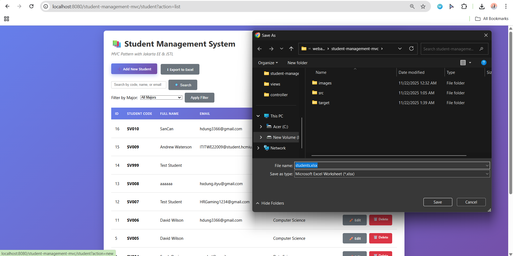
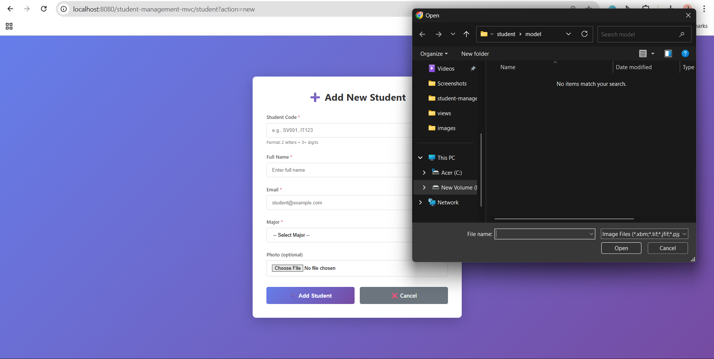
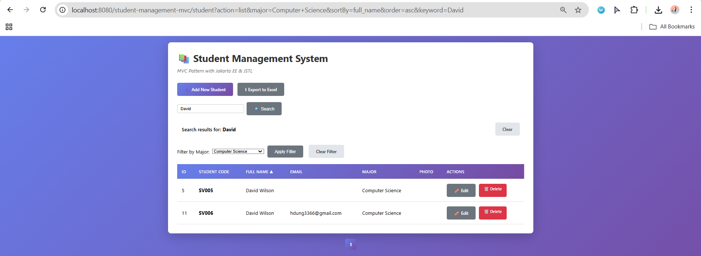


