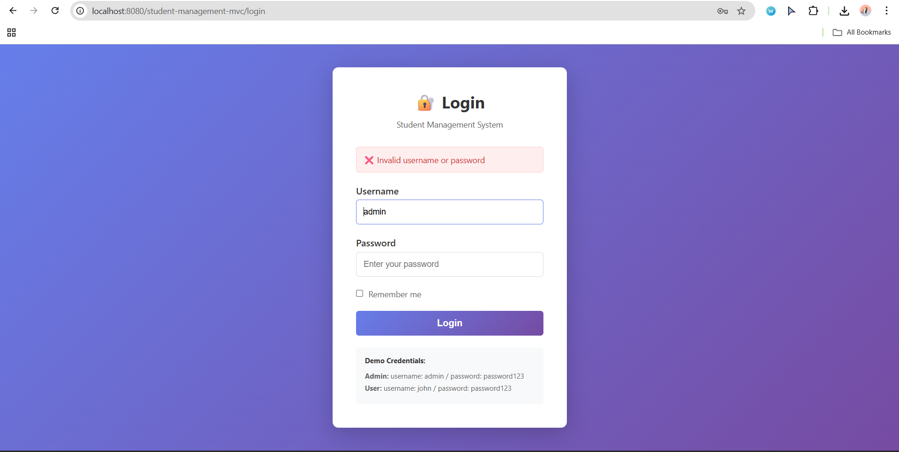
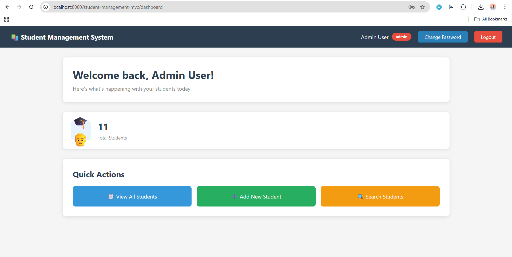
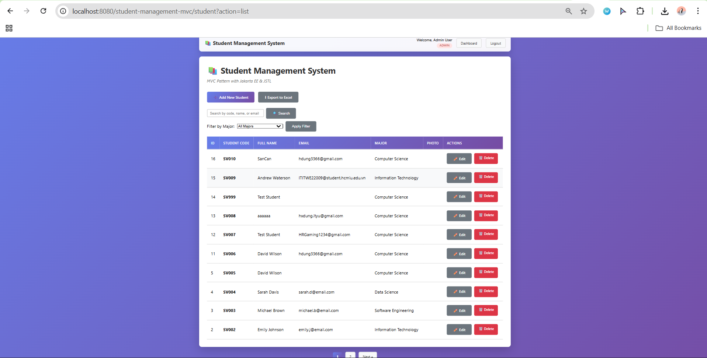
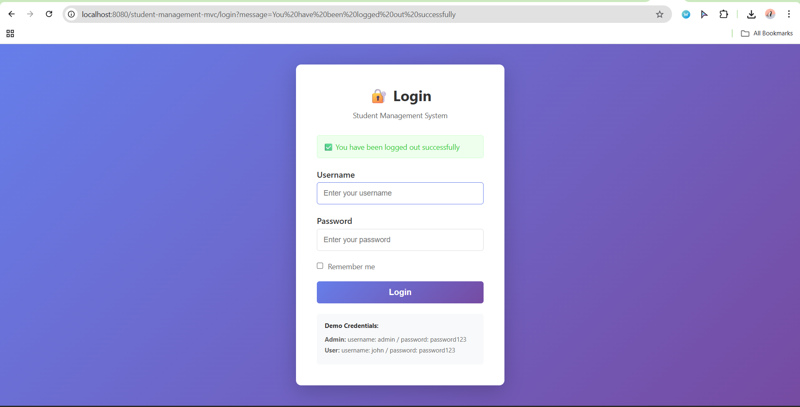
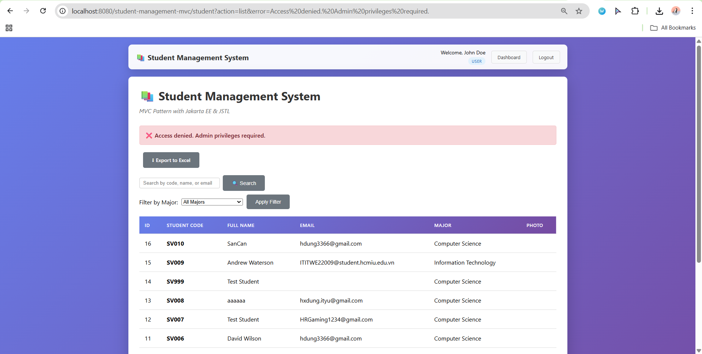
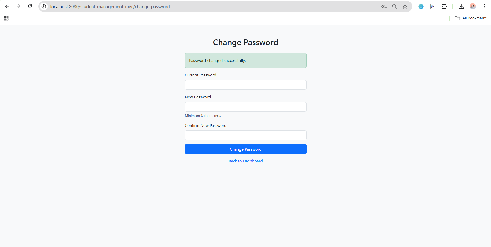

-Fullname: Hoang Xuan Dung
-StudentID : ITITWE22009
-Course: Web Application Development


# LAB 6 – Authentication & Session Management  
## Step 1 – Accessing the Application for the First Time

This README describes **exactly what happens in the code** when a user first accesses the web application:

```text
http://localhost:8080/StudentManagementMVC_Lab6/
```

or, more generically:

```text
http://localhost:8080/YourApp/
```

It focuses on:

- Which **Java classes** and **JSP pages** are involved
- The **request flow** through filters and controllers
- What happens if a user tries to go directly to protected pages like  
  `/student` or `/dashboard` **before logging in**

The explanation is based on the actual project structure:

```text
src/
 ├─ model/
 │   ├─ Student.java
 │   └─ User.java
 ├─ dao/
 │   ├─ StudentDAO.java
 │   └─ UserDAO.java
 ├─ controller/
 │   ├─ StudentController.java
 │   ├─ LoginController.java
 │   ├─ LogoutController.java
 │   └─ DashboardController.java
 └─ filter/
     ├─ AuthFilter.java
     └─ AdminFilter.java

WebContent/
 └─ views/
     ├─ student-list.jsp
     ├─ login.jsp
     └─ dashboard.jsp

database/
 └─ users_table.sql
```

---

## DEMO


---

## 1. Components Involved in Step 1

When the user only **opens the application** (no login yet), the behaviour is driven by these main components:

1. **`AuthFilter`** – global authentication filter  
   - Class: `com.student.filter.AuthFilter`  
   - Annotation: `@WebFilter(filterName = "AuthFilter", urlPatterns = {"/*"})`  
   - Purpose: Protects all URLs and redirects unauthenticated users to `/login`.

2. **`LoginController`** – login servlet  
   - Class: `com.student.controller.LoginController`  
   - Annotation: `@WebServlet("/login")`  
   - Purpose (GET): Show the login form (`login.jsp`).  
   - Purpose (POST): Process login, create session, redirect to dashboard or student list.

3. **`DashboardController`** – dashboard servlet  
   - Class: `com.student.controller.DashboardController`  
   - Annotation: `@WebServlet("/dashboard")`  
   - Purpose: Display dashboard **after login** (protected).

4. **`StudentController`** – student management servlet  
   - Class: `com.student.controller.StudentController`  
   - Annotation: `@WebServlet("/student")`  
   - Purpose: List, create, edit, delete students (protected).

5. **JSP views**  
   - `views/login.jsp` – login page  
   - `views/dashboard.jsp` – dashboard view  
   - `views/student-list.jsp` – student list view

For **Step 1**, only `AuthFilter` and `LoginController` actually run, because the user is **not logged in yet**.

---

## 2. AuthFilter – Global Authentication Gate

### 2.1. Filter Mapping

`AuthFilter` is annotated like this:

```java
@WebFilter(filterName = "AuthFilter", urlPatterns = {"/*"})
public class AuthFilter implements Filter {
    ...
}
```

- `urlPatterns = {"/*"}` means the filter is executed for **every request** inside the application:
  - `/`
  - `/login`
  - `/logout`
  - `/dashboard`
  - `/student`
  - any other servlet or JSP

So, **no controller can run before `AuthFilter` has checked the request.**

### 2.2. Public URLs

Inside `AuthFilter`, there is a list of URLs or extensions that are considered **public** (do not require login):

```java
private static final String[] PUBLIC_URLS = {
    "/login",
    "/logout",
    ".css",
    ".js",
    ".png",
    ".jpg",
    ".jpeg",
    ".gif"
};
```

Later, the method `isPublicUrl(String path)` loops over this array and returns `true` if the requested path contains any of these values.

That means:

- `/login` and `/logout` are **public**
- static files such as `style.css` or `app.js` are **public**
- everything else is considered **protected**

### 2.3. Extracting the Request Path

In `doFilter`, the filter extracts the path that the user is trying to access:

```java
String requestURI = httpRequest.getRequestURI();
String contextPath = httpRequest.getContextPath();
String path = requestURI.substring(contextPath.length());
```

Examples:

- If the user goes to `http://localhost:8080/StudentManagementMVC_Lab6/`  
  - `requestURI = "/StudentManagementMVC_Lab6/"`  
  - `contextPath = "/StudentManagementMVC_Lab6"`  
  - `path = "/"`

- If the user goes to `http://localhost:8080/StudentManagementMVC_Lab6/student?action=list`  
  - `requestURI = "/StudentManagementMVC_Lab6/student"`  
  - `contextPath = "/StudentManagementMVC_Lab6"`  
  - `path = "/student"`

This `path` variable is the one used to decide whether the URL is public or protected.

### 2.4. Public vs Protected Decision

The filter then checks:

```java
if (isPublicUrl(path)) {
    // Allow access to public URLs
    chain.doFilter(request, response);
    return;
}
```

- If `path` is public → skip authentication logic → let the request continue.
- If `path` is not public → perform session check.

For the root path `/`:

- `path = "/"` does **not** contain any of the public strings (`"/login"`, `"/logout"`, `.css`, etc.)
- Therefore `isPublicUrl("/")` returns `false`
- So `/` is treated as a **protected** URL

### 2.5. Session Check

If the URL is not public, the filter checks whether the user is already logged in:

```java
HttpSession session = httpRequest.getSession(false);
boolean isLoggedIn = (session != null && session.getAttribute("user") != null);
```

- `getSession(false)` returns the existing session if it exists, or `null` if there is no session yet.
- The user is considered logged in only if:
  - a session exists, **and**
  - the session contains a `user` attribute.

Then:

```java
if (isLoggedIn) {
    // User is logged in, allow access
    chain.doFilter(request, response);
} else {
    // User not logged in, redirect to login
    String loginURL = contextPath + "/login";
    httpResponse.sendRedirect(loginURL);
}
```

So if the user is **not logged in**, any access to a **protected URL** will result in a redirect to `/login`.

---

## 3. Scenario A – First Visit to the Application Root (`/`)

### 3.1. HTTP Request

The user opens the browser and types:

```text
http://localhost:8080/StudentManagementMVC_Lab6/
```

The browser sends a `GET` request to the server:

```http
GET /StudentManagementMVC_Lab6/ HTTP/1.1
Host: localhost:8080
```

### 3.2. Execution Order

1. **Tomcat receives the request** for `/StudentManagementMVC_Lab6/`.
2. Because `AuthFilter` is mapped to `/*`, **`AuthFilter.doFilter()` runs first**.
3. Inside `doFilter`:
   - `requestURI = "/StudentManagementMVC_Lab6/"`
   - `contextPath = "/StudentManagementMVC_Lab6"`
   - `path = "/"`

4. `isPublicUrl("/")` is called:
   - It checks each entry in `PUBLIC_URLS`.
   - `/` does not match `/login`, `/logout`, or any static extension.
   - Result: `false` → `/` is **not public**.

5. Because the URL is protected, the filter checks the session:
   - This is the first visit, so there is **no existing session**.
   - `getSession(false)` returns `null`.
   - `isLoggedIn` becomes `false`.

6. Since `isLoggedIn == false`, the filter executes:

   ```java
   String loginURL = contextPath + "/login";
   httpResponse.sendRedirect(loginURL);
   ```

   In this case: `loginURL = "/StudentManagementMVC_Lab6/login"`.

7. The filter **does not call `chain.doFilter()`** for this request, so **no controller or JSP is executed** for `/` itself. The request is short-circuited and turned into a redirect to `/login`.

### 3.3. Result in the Browser

The browser receives a `302` redirect response with:

```http
Location: /StudentManagementMVC_Lab6/login
```

The browser then automatically sends a **new** request to `/login`:

```http
GET /StudentManagementMVC_Lab6/login HTTP/1.1
Host: localhost:8080
```

Now another flow starts (also passing through `AuthFilter`), which is responsible for rendering the **login page**. That flow is part of Step 2 (login), but the key point of Step 1 is:

> **Any visit to the application root `/` is immediately redirected to `/login` by `AuthFilter` if the user is not logged in.**

---

## 4. Scenario B – Direct Access to `/login`

For completeness, here is what happens when the redirected request reaches `/login`.

### 4.1. AuthFilter on `/login`

Request:

```text
/StudentManagementMVC_Lab6/login
```

Processing:

1. `AuthFilter.doFilter()` runs again:
   - `path = "/login"`
   - `isPublicUrl("/login")` returns `true` because `/login` is in `PUBLIC_URLS`.

2. Because it is public, the filter just calls:

   ```java
   chain.doFilter(request, response);
   ```

   and does **not** perform a session redirect.

### 4.2. LoginController.doGet()

Now the request reaches the `LoginController`:

```java
@WebServlet("/login")
public class LoginController extends HttpServlet {
    ...
    @Override
    protected void doGet(HttpServletRequest request, HttpServletResponse response)
            throws ServletException, IOException {

        // If already logged in, redirect to dashboard
        HttpSession session = request.getSession(false);
        if (session != null && session.getAttribute("user") != null) {
            response.sendRedirect("dashboard");
            return;
        }

        // Show login page
        request.getRequestDispatcher("/views/login.jsp").forward(request, response);
    }
}
```

Because this is the first visit and there is no session:

- `session == null`
- The condition `session != null && session.getAttribute("user") != null` is false.
- The controller forwards the request to `login.jsp`.

### 4.3. Rendering `login.jsp`

`/views/login.jsp` is rendered and sent back to the browser.  
Now the user sees the **login form** and can submit credentials.

At this point, **Step 1 is complete**:

- Opening `/` → forced redirect to `/login`
- `/login` → `LoginController.doGet()` → `login.jsp`

---

## 5. Scenario C – Direct Access to `/student` Before Login

Now we consider what happens if an unauthenticated user tries to skip the login page and directly visit the student list:

```text
http://localhost:8080/StudentManagementMVC_Lab6/student?action=list
```

### 5.1. AuthFilter on `/student`

1. Request arrives at `/student`.
2. `AuthFilter` runs:
   - `requestURI = "/StudentManagementMVC_Lab6/student"`
   - `contextPath = "/StudentManagementMVC_Lab6"`
   - `path = "/student"`

3. `isPublicUrl("/student")` is evaluated:
   - `/student` is **not** in `PUBLIC_URLS`
   - No static file extension
   - Result: `false` → `/student` is **protected**

4. Session check:

   ```java
   HttpSession session = httpRequest.getSession(false);
   boolean isLoggedIn = (session != null && session.getAttribute("user") != null);
   ```

   - User is still not logged in → `session == null` → `isLoggedIn == false`.

5. Because `isLoggedIn` is `false`, `AuthFilter` redirects to `/login` again:

   ```java
   httpResponse.sendRedirect(contextPath + "/login");
   ```

6. **Important:** `StudentController` does **not** run at all in this case.  
   No student list is shown until the user successfully logs in.

### 5.2. AdminFilter and Role-Based Access

There is also an `AdminFilter` mapped to `/student` (for admin-only actions). However:

- `AuthFilter` runs **before** `AdminFilter` because it is mapped globally (`/*`) and handles authentication.
- While the user is **not authenticated**, any request to `/student` is already blocked by `AuthFilter`.
- Therefore, for Step 1 (before login), `AdminFilter` is **never reached**.

Only after login (Step 3 and Step 4 in your demo) will:

- `AuthFilter` allow the request through
- `AdminFilter` then check the `role` in the session for admin actions (`new`, `edit`, `delete`)

---

## 6. Scenario D – Direct Access to `/dashboard` Before Login

Now we test:

```text
http://localhost:8080/StudentManagementMVC_Lab6/dashboard
```

### 6.1. AuthFilter on `/dashboard`

1. Request arrives at `/dashboard`.
2. `AuthFilter` intercepts it:
   - `path = "/dashboard"`
   - `isPublicUrl("/dashboard")` → `false` (it is not in `PUBLIC_URLS`).

3. Session check:
   - No session yet → `isLoggedIn == false`.

4. Redirect:

   ```java
   httpResponse.sendRedirect(contextPath + "/login");
   ```

Result:

- The user is sent back to the login page.
- `DashboardController` is **not executed**.

### 6.2. Double Protection

Even inside `DashboardController`, there is an additional session check:

```java
HttpSession session = request.getSession(false);
if (session == null || session.getAttribute("user") == null) {
    response.sendRedirect("login");
    return;
}
```

This means:

- Even if, for some reason, a request reached `/dashboard` without passing through `AuthFilter`, the controller itself would still refuse access and redirect to `/login`.

This pattern is sometimes called **defense in depth**: the filter protects at a global level, and the controller protects again at the local level.

---

## 7. Summary of Step 1 Behaviour

Before any successful login, the access control behaviour is:

| URL / Path                                   | Public? | Who handles it first? | Result (Unauthenticated User)                               |
|----------------------------------------------|---------|------------------------|--------------------------------------------------------------|
| `/`                                          | No      | `AuthFilter`           | Redirects to `/login`                                       |
| `/login`                                     | Yes     | `AuthFilter` → `LoginController` | Login page is displayed (`login.jsp`)             |
| `/logout`                                    | Yes     | `AuthFilter` → `LogoutController` | Usually ends session and redirects to `/login` |
| `/dashboard`                                 | No      | `AuthFilter`           | Redirects to `/login` (controller not executed)             |
| `/student?action=list`                       | No      | `AuthFilter`           | Redirects to `/login` (controller not executed)             |
| `/student?action=new/edit/delete/...`        | No      | `AuthFilter`           | Redirects to `/login` (AdminFilter not reached yet)         |

### Key Points for the Report

- **AuthFilter is the first line of defense** and runs for every request.
- **Root path `/` is treated as a protected page**, so unauthenticated access is always redirected to `/login`.
- Attempting to access `/student` or `/dashboard` directly before login will **never reach the controller**; the filter redirects to `/login` first.
- Only `/login` and `/logout` (and static files) are publicly accessible.
- This guarantees that the user **must authenticate** before seeing any student data or dashboard statistics.


# LAB 6 – Authentication & Session Management  
## Step 2 – Login with `admin / password123`

This document explains in detail what happens in the application when a user logs in with:

```text
username: admin
password: password123
```

It describes:

- Which classes and methods are executed
- How the credentials are validated against the database
- How a successful login creates an HTTP session and redirects the user
- What happens when the login **fails** (wrong username/password or inactive account)

The analysis is based on the following key classes and views:

```text
src/
 ├─ dao/
 │   └─ UserDAO.java
 ├─ controller/
 │   └─ LoginController.java
 └─ model/
     └─ User.java

WebContent/
 └─ views/
     └─ login.jsp
```
---

## DEMO



---

## 1. Starting Point – Submitting the Login Form

After **Step 1**, the user is already on the login page:

```text
GET /StudentManagementMVC_Lab6/login
```

The page `views/login.jsp` shows a form similar to:

```html
<form method="post" action="login">
    <!-- username, password inputs, etc. -->
    <button type="submit">Login</button>
</form>
```

When the user enters `admin` / `password123` and clicks **Login**, the browser sends an HTTP POST request:

```http
POST /StudentManagementMVC_Lab6/login HTTP/1.1
Host: localhost:8080
Content-Type: application/x-www-form-urlencoded

username=admin&password=password123&remember=on
```

(If the “Remember me” checkbox is not checked, the parameter `remember` may be `null`.)

---

## 2. AuthFilter on `/login` (POST Request)

Even for the POST request, the first Java component handling the request is still **`AuthFilter`** because it is mapped to all URLs:

```java
@WebFilter(filterName = "AuthFilter", urlPatterns = {"/*"})
public class AuthFilter implements Filter { ... }
```

Inside `doFilter`, the filter calculates:

```java
String requestURI = httpRequest.getRequestURI();     // "/StudentManagementMVC_Lab6/login"
String contextPath = httpRequest.getContextPath();   // "/StudentManagementMVC_Lab6"
String path = requestURI.substring(contextPath.length());  // "/login"
```

Then it checks whether `/login` is a **public URL**:

```java
if (isPublicUrl(path)) {
    chain.doFilter(request, response);
    return;
}
```

Because `/login` is explicitly listed in `PUBLIC_URLS`, the filter:

- **does not** perform a session check,
- **does not** redirect,
- and simply calls `chain.doFilter(...)`.

The request now continues to the `LoginController`.

---

## 3. LoginController – Handling the POST `/login`

The login logic is implemented in `LoginController`:

```java
@WebServlet("/login")
public class LoginController extends HttpServlet {

    private UserDAO userDAO;

    @Override
    public void init() {
        userDAO = new UserDAO();
    }

    @Override
    protected void doPost(HttpServletRequest request, HttpServletResponse response) 
            throws ServletException, IOException {

        String username = request.getParameter("username");
        String password = request.getParameter("password");
        String rememberMe = request.getParameter("remember");

        // ...
    }
}
```

### 3.1. Reading Request Parameters

At the top of `doPost`, the servlet reads form inputs:

```java
String username = request.getParameter("username");
String password = request.getParameter("password");
String rememberMe = request.getParameter("remember");
```

For this scenario:

- `username = "admin"`
- `password = "password123"`
- `rememberMe` is either `"on"` or `null` depending on checkbox

### 3.2. Basic Input Validation

Before touching the database, the controller validates that both fields are present:

```java
if (username == null || username.trim().isEmpty() ||
    password == null || password.trim().isEmpty()) {

    request.setAttribute("error", "Username and password are required");
    request.getRequestDispatcher("/views/login.jsp")
           .forward(request, response);
    return;
}
```

If either field is empty, the method:

1. Sets an error message in the **request scope**.
2. Forwards back to `login.jsp` (no redirect, no session).
3. Ends the method (`return`).

In our case (`admin` / `password123`), both fields are non-empty, so the validation passes and execution continues.

### 3.3. Calling `UserDAO.authenticate(...)`

The next step is to authenticate the user using `UserDAO`:

```java
// Authenticate user
User user = userDAO.authenticate(username, password);
```

This line delegates the actual authentication logic to the data access layer.

---

## 4. UserDAO – Verifying Credentials with BCrypt

The `UserDAO` class encapsulates all database access for `User` objects. Relevant parts:

```java
public class UserDAO {

    private static final String DB_URL = "jdbc:mysql://localhost:3306/student_management";
    private static final String DB_USER = "root";
    private static final String DB_PASSWORD = "********";

    // SQL Queries
    private static final String SQL_AUTHENTICATE =
        "SELECT * FROM users WHERE username = ? AND is_active = TRUE";
```

### 4.1. `authenticate(String username, String password)`

The important method is:

```java
public User authenticate(String username, String password) {
    User user = null;

    try (Connection conn = getConnection();
         PreparedStatement pstmt = conn.prepareStatement(SQL_AUTHENTICATE)) {

        pstmt.setString(1, username);

        try (ResultSet rs = pstmt.executeQuery()) {
            if (rs.next()) {
                String hashedPassword = rs.getString("password");

                // Verify password with BCrypt
                if (BCrypt.checkpw(password, hashedPassword)) {
                    user = mapResultSetToUser(rs);

                    // Update last login time
                    updateLastLogin(user.getId());
                }
            }
        }

    } catch (SQLException e) {
        e.printStackTrace();
    }

    return user;
}
```

**Step-by-step flow:**

1. **Open database connection**

   ```java
   Connection conn = getConnection();
   ```

   - Uses JDBC URL `jdbc:mysql://localhost:3306/student_management`
   - Connects with username and password configured in `DB_USER` / `DB_PASSWORD`.

2. **Prepare SQL statement**

   ```java
   PreparedStatement pstmt = conn.prepareStatement(SQL_AUTHENTICATE);
   pstmt.setString(1, username);
   ```

   The SQL will select users by username **only if** `is_active = TRUE`, so deactivated users cannot log in.

3. **Execute query**

   ```java
   ResultSet rs = pstmt.executeQuery();
   ```

   - If no row is returned → username does not exist or is inactive → method returns `null`.
   - If a row is found → proceed to password verification.

4. **Read hashed password from DB**

   ```java
   String hashedPassword = rs.getString("password");
   ```

   This is the **BCrypt hash** stored in the database.  
   For the `admin` account, this hash was previously generated by `PasswordHashGenerator` (or `UserDAO.main`) from the plaintext `password123`.

5. **Verify password using BCrypt**

   ```java
   if (BCrypt.checkpw(password, hashedPassword)) {
       user = mapResultSetToUser(rs);
       updateLastLogin(user.getId());
   }
   ```

   - `BCrypt.checkpw(plaintext, hash)` returns `true` if the plaintext matches the stored hash.
   - If the password is **correct**, the code:
     - Creates a `User` object by calling `mapResultSetToUser(rs)`
     - Calls `updateLastLogin(user.getId())` to update the `last_login` column
   - If the password is **incorrect**, `checkpw` returns `false` and `user` remains `null`.

6. **Return result**

   - On success: returns a fully populated `User` object (with `id`, `username`, `fullName`, `role`, etc.).
   - On failure: returns `null`.

### 4.2. Mapping DB row → `User` object

```java
private User mapResultSetToUser(ResultSet rs) throws SQLException {
    User user = new User();
    user.setId(rs.getInt("id"));
    user.setUsername(rs.getString("username"));
    user.setPassword(rs.getString("password"));
    user.setFullName(rs.getString("full_name"));
    user.setRole(rs.getString("role"));
    user.setActive(rs.getBoolean("is_active"));
    user.setCreatedAt(rs.getTimestamp("created_at"));
    user.setLastLogin(rs.getTimestamp("last_login"));
    return user;
}
```

This is the object that will later be stored in the HTTP session.

---

## 5. Back to LoginController – Successful Login Flow

After `userDAO.authenticate(username, password)` returns, `LoginController` checks the result:

```java
User user = userDAO.authenticate(username, password);

if (user != null) {
    // Authentication successful

    // Invalidate old session (prevent session fixation)
    HttpSession oldSession = request.getSession(false);
    if (oldSession != null) {
        oldSession.invalidate();
    }

    // Create new session
    HttpSession session = request.getSession(true);
    session.setAttribute("user", user);
    session.setAttribute("role", user.getRole());
    session.setAttribute("fullName", user.getFullName());

    // Set session timeout (30 minutes)
    session.setMaxInactiveInterval(30 * 60);

    // Handle "Remember Me" (optional - cookie implementation)
    if ("on".equals(rememberMe)) {
        // TODO: Implement remember me functionality with cookie
    }

    // Redirect based on role
    if (user.isAdmin()) {
        response.sendRedirect("dashboard");
    } else {
        response.sendRedirect("student?action=list");
    }

} else {
    // Authentication failed
    request.setAttribute("error", "Invalid username or password");
    request.setAttribute("username", username); // Keep username in form
    request.getRequestDispatcher("/views/login.jsp").forward(request, response);
}
```

### 5.1. Case 1: `user != null` (Correct credentials)

For `admin / password123`:

- The account exists in the `users` table.
- `is_active = TRUE`.
- `BCrypt.checkpw("password123", storedHash)` returns `true`.

So `user` is **not null**, and the **success branch** is executed.

#### 5.1.1. Invalidate any old session

```java
HttpSession oldSession = request.getSession(false);
if (oldSession != null) {
    oldSession.invalidate();
}
```

This prevents **session fixation** attacks by discarding any previous session that might exist.

#### 5.1.2. Create a new session

```java
HttpSession session = request.getSession(true);
session.setAttribute("user", user);
session.setAttribute("role", user.getRole());
session.setAttribute("fullName", user.getFullName());
```

- `getSession(true)` creates a **new HTTP session**.
- Several attributes are stored:

  | Attribute name | Value                              | Purpose                                  |
  |----------------|------------------------------------|------------------------------------------|
  | `"user"`       | `User` object (full entity)        | Used by filters/controllers to check login |
  | `"role"`       | `"admin"` or `"user"`              | Used for role-based access (AdminFilter, JSP) |
  | `"fullName"`   | User’s full name (e.g., `"Admin User"`) | Displayed in navbar / dashboard UI      |

These attributes are later used by:

- `AuthFilter` → checks if `session.getAttribute("user")` is present.
- `AdminFilter` → checks if `session.getAttribute("role")` equals `"admin"`.
- JSP pages → display `Welcome, ${sessionScope.fullName}` or show/hide buttons based on role.

#### 5.1.3. Session timeout

```java
session.setMaxInactiveInterval(30 * 60); // 30 minutes
```

If the user is inactive (no requests) for 30 minutes, the session will expire automatically.

#### 5.1.4. “Remember Me” placeholder

```java
if ("on".equals(rememberMe)) {
    // TODO: Implement remember me functionality with cookie
}
```

The checkbox is wired in the code, but the actual cookie-based implementation is intentionally left as a TODO for the lab. It does **not** affect the core login logic.

#### 5.1.5. Redirect based on role

Finally, the controller decides where to send the user:

```java
if (user.isAdmin()) {
    response.sendRedirect("dashboard");
} else {
    response.sendRedirect("student?action=list");
}
```

The `User` model contains helper methods like:

```java
public boolean isAdmin() {
    return "admin".equalsIgnoreCase(this.role);
}

public boolean isUser() {
    return "user".equalsIgnoreCase(this.role);
}
```

For the `admin` account:

- `user.getRole()` returns `"admin"`.
- `user.isAdmin()` returns `true`.

So the browser is redirected to:

```text
/StudentManagementMVC_Lab6/dashboard
```

This starts the **dashboard flow**, which goes through `AuthFilter` again but now passes the session check because `session.getAttribute("user")` is non-null.

At this point, **login is complete** and the user is considered authenticated.

---

## 6. Back to the Login Page – Failed Login Flow

If authentication fails at any point, `userDAO.authenticate(username, password)` returns `null`. This happens when:

- Username does **not** exist in the `users` table, or
- `is_active = FALSE`, or
- BCrypt password check fails (wrong password).

In that case, the controller executes the **else** branch:

```java
// Authentication failed
request.setAttribute("error", "Invalid username or password");
request.setAttribute("username", username); // Keep username in form
request.getRequestDispatcher("/views/login.jsp").forward(request, response);
```

### 6.1. Behaviour in the Browser

- The request is **forwarded** (not redirected) to `login.jsp`.
- The URL in the browser stays `/login` (POST→forward).
- No session is created or modified.
- `login.jsp` can read:

  - `requestScope.error` → to display an error message (e.g., red alert).
  - `requestScope.username` → to pre-fill the username input so the user does not have to type it again.

The user sees the login page again with an error such as:

> **Invalid username or password**

and can try again.

---

## 7. Summary of Step 2 – Login with `admin / password123`

### 7.1. Successful Login (Admin)

1. User submits form with `admin / password123`.
2. Request: `POST /login`.
3. `AuthFilter` sees `/login` as public → passes request through.
4. `LoginController.doPost()`:
   - Reads `username`, `password`, `rememberMe`.
   - Validates that fields are not empty.
   - Calls `userDAO.authenticate("admin", "password123")`.
5. `UserDAO.authenticate`:
   - Executes `SELECT * FROM users WHERE username = 'admin' AND is_active = TRUE`.
   - Loads stored BCrypt hash.
   - Verifies password with `BCrypt.checkpw`.
   - On success, maps row to `User` and updates `last_login`.
6. Back in `LoginController`:
   - `user != null` → authentication OK.
   - Invalidates any previous session.
   - Creates new session and stores `user`, `role`, `fullName`.
   - Sets session timeout to 30 minutes.
   - Redirects to `/dashboard` because `user.isAdmin() == true`.
7. Dashboard and subsequent pages now see the user as **authenticated admin**, enabling admin-only UI and features.

### 7.2. Failed Login (Wrong Credentials)

1. User submits wrong username or password.
2. `AuthFilter` again lets `/login` through.
3. `LoginController.doPost()` reads inputs and calls `userDAO.authenticate(...)`.
4. `UserDAO.authenticate`:
   - Returns `null` because:
     - No matching row, or
     - `BCrypt.checkpw` returned `false`, or
     - `is_active = FALSE`.
5. `LoginController` goes into the **failure** branch:
   - Sets `error = "Invalid username or password"`.
   - Sets `username` to keep the input value.
   - Forwards back to `login.jsp`.
6. `login.jsp` displays the error message; no session is created; user remains unauthenticated.

# LAB 6 – Authentication & Session Management  
## Step 3 – Click **“View All Students”**

This document explains in detail what happens when an authenticated user (for this step, the **admin** user) clicks the **“📋 View All Students”** button on the dashboard.

We will describe:

- Which URLs are requested
- Which filters and controllers are executed, and in which order
- How the student list is loaded from the database
- How the `student-list.jsp` view is rendered
- Why **Edit/Delete** buttons are **visible for admin**, and which code controls that

The analysis is based on these files:

```text
src/
 ├─ controller/
 │   ├─ DashboardController.java
 │   └─ StudentController.java
 ├─ dao/
 │   └─ StudentDAO.java
 ├─ filter/
 │   ├─ AuthFilter.java
 │   └─ AdminFilter.java
 └─ model/
     └─ Student.java

WebContent/
 └─ views/
     ├─ dashboard.jsp
     └─ student-list.jsp
```

---

## DEMO


---

## 1. Starting Point – Authenticated Admin on Dashboard

At the end of **Step 2**, the admin user has successfully logged in:

- The browser is currently showing the **dashboard** page.
- The server-side HTTP session contains:

| Attribute name | Example value                  |
|----------------|--------------------------------|
| `user`         | `User` object for `admin`      |
| `role`         | `"admin"`                      |
| `fullName`     | `"Admin User"` (or similar)    |

These attributes are set in `LoginController.doPost()` after a successful login and are used in both filters and JSP pages.

The dashboard is rendered by the servlet:

```java
@WebServlet("/dashboard")
public class DashboardController extends HttpServlet { ... }
```

and the JSP view:

```text
/views/dashboard.jsp
```

Inside `dashboard.jsp`, there is a **Quick Actions** section with this link:

```jsp
<div class="quick-actions">
    <h2>Quick Actions</h2>
    <div class="action-grid">
        <a href="student?action=list" class="action-btn action-btn-primary">
            📋 View All Students
        </a>

        <c:if test="${sessionScope.role eq 'admin'}">
            <a href="student?action=new" class="action-btn action-btn-success">
                ➕ Add New Student
            </a>
        </c:if>

        <a href="student?action=search" class="action-btn action-btn-warning">
            🔍 Search Students
        </a>
    </div>
</div>
```

When the admin clicks on **“📋 View All Students”**, the browser navigates to:

```text
GET /StudentManagementMVC_Lab6/student?action=list
```

This request triggers the whole flow described in the next sections.

---

## 2. Request Flow Overview

For the URL `/student?action=list`, the execution order on the server side is:

1. **`AuthFilter`** – checks whether the user is authenticated.
2. **`AdminFilter`** – checks whether the requested student action is admin-only.
3. **`StudentController`** – dispatches to the correct method based on `action` (`list`, `new`, `edit`, etc.).
4. **`StudentDAO`** – fetches the list of students (with optional filter/sort/pagination).
5. **`student-list.jsp`** – renders the student list and role-based UI (Edit/Delete buttons).

We will now go through each component step by step.

---

## 3. AuthFilter – Authentication Check for `/student?action=list`

### 3.1. Filter Mapping

`AuthFilter` is mapped globally:

```java
@WebFilter(filterName = "AuthFilter", urlPatterns = {"/*"})
public class AuthFilter implements Filter { ... }
```

This means it will run on `/student` just like on every other URL.

### 3.2. Path Extraction

Inside `doFilter`, the filter computes the path:

```java
String requestURI = httpRequest.getRequestURI();     // "/StudentManagementMVC_Lab6/student"
String contextPath = httpRequest.getContextPath();   // "/StudentManagementMVC_Lab6"
String path = requestURI.substring(contextPath.length()); // "/student"
```

Then, it checks whether the path is public:

```java
if (isPublicUrl(path)) {
    chain.doFilter(request, response);
    return;
}
```

Since `/student` is **not** in the list of public URLs (those are mostly `/login`, `/logout`, and static files), `/student` is considered **protected**.

### 3.3. Session Check – Authenticated Admin

AuthFilter checks the session:

```java
HttpSession session = httpRequest.getSession(false);
boolean isLoggedIn = (session != null && session.getAttribute("user") != null);
```

At this point:

- A valid session exists (created during login).
- `session.getAttribute("user")` is a `User` object for the admin.

Therefore:

- `isLoggedIn == true`
- The filter **allows the request to continue**:

```java
if (isLoggedIn) {
    chain.doFilter(request, response);
} else {
    httpResponse.sendRedirect(contextPath + "/login");
}
```

The request now moves on to the next filter: `AdminFilter`.

---

## 4. AdminFilter – Role Check for Admin-Only Actions

### 4.1. Filter Mapping

`AdminFilter` is mapped specifically to the `/student` servlet:

```java
@WebFilter(filterName = "AdminFilter", urlPatterns = {"/student"})
public class AdminFilter implements Filter { ... }
```

This filter runs **after** `AuthFilter` and **before** `StudentController`.

### 4.2. Determine Requested Action

Inside `doFilter`, the filter reads the `action` parameter:

```java
String action = httpRequest.getParameter("action");
```

In this step, the URL is `student?action=list`, so:

```text
action = "list"
```

The filter defines a list of admin-only actions, for example:

```java
private static final String[] ADMIN_ACTIONS = { "new", "edit", "delete" };
```

and the helper:

```java
private boolean isAdminAction(String action) {
    if (action == null) return false;

    for (String adminAction : ADMIN_ACTIONS) {
        if (adminAction.equals(action)) {
            return true;
        }
    }
    return false;
}
```

### 4.3. Check Role vs Action

Now `AdminFilter` combines the requested action with the user’s role:

```java
HttpSession session = httpRequest.getSession(false);
User user = (session != null) ? (User) session.getAttribute("user") : null;

boolean isAdmin = (user != null && user.isAdmin());

if (isAdminAction(action) && !isAdmin) {
    // Non-admin trying to perform admin-only action
    httpResponse.sendRedirect(httpRequest.getContextPath() 
        + "/student?action=list&error=You do not have permission to perform this action");
    return;
}
```

For our case:

- `action = "list"`
- `isAdminAction("list")` → `false`
- So the filter **does not block** the request, regardless of whether the user is admin or regular.

The filter simply calls:

```java
chain.doFilter(request, response);
```

and the request proceeds to `StudentController`.

> Note: For `action=new`, `edit`, or `delete`, the filter would allow only admins and redirect regular users back to the student list with an error message.

---

## 5. StudentController – Handling `action=list`

The `StudentController` servlet is responsible for all student-related requests:

```java
@WebServlet("/student")
public class StudentController extends HttpServlet {

    private StudentDAO studentDAO;

    @Override
    public void init() {
        studentDAO = new StudentDAO();
    }

    @Override
    protected void doGet(HttpServletRequest request, HttpServletResponse response) 
            throws ServletException, IOException {

        String action = request.getParameter("action");

        if (action == null) {
            action = "list";
        }

        switch (action) {
            case "new":
                showNewForm(request, response);
                break;
            case "edit":
                showEditForm(request, response);
                break;
            case "delete":
                deleteStudent(request, response);
                break;
            case "search":
                searchStudents(request, response);
                break;
            case "sort":
                sortStudents(request, response);
                break;
            case "filter":
                filterStudents(request, response);
                break;
            default:
                listStudents(request, response);
                break;
        }
    }
}
```

For our request `student?action=list`:

- `action` is `"list"`.
- None of the explicit `case` labels match (`"new"`, `"edit"`, `"delete"`, `"search"`, `"sort"`, `"filter"`).
- The `default` branch is executed:

```java
default:
    listStudents(request, response);
    break;
```

So the flow now enters the `listStudents(...)` method.

---

## 6. listStudents – Loading Data and Handling Pagination/Filter

The `listStudents` method combines:

- Search/filter/sort (bonus feature)
- Pagination (EX8 requirement)

Simplified, its structure is:

```java
private void listStudents(HttpServletRequest request, HttpServletResponse response) 
        throws ServletException, IOException {

    // 1. Read parameters for keyword, major, sorting
    String keyword = request.getParameter("keyword");
    String major = request.getParameter("major");
    String sortBy = request.getParameter("sortBy");
    String order = request.getParameter("order");

    boolean hasFilter = (keyword != null && !keyword.trim().isEmpty())
            || (major != null && !major.trim().isEmpty())
            || (sortBy != null && !sortBy.trim().isEmpty());

    // 2. If there is any filter/sort, use a dynamic DAO method
    if (hasFilter) {
        List<Student> students = studentDAO.findStudents(keyword, major, sortBy, order);

        request.setAttribute("students", students);
        request.setAttribute("keyword", keyword);
        request.setAttribute("selectedMajor", major);
        request.setAttribute("sortBy", sortBy);
        request.setAttribute("order", order);

        // No pagination when using full filter mode
        request.setAttribute("currentPage", 1);
        request.setAttribute("totalPages", 1);

        RequestDispatcher dispatcher = request.getRequestDispatcher("/views/student-list.jsp");
        dispatcher.forward(request, response);
        return;
    }

    // 3. If no filter, handle pagination (EX8)

    String pageParam = request.getParameter("page");
    int currentPage = 1;

    if (pageParam != null) {
        try {
            currentPage = Integer.parseInt(pageParam);
        } catch (NumberFormatException e) {
            currentPage = 1;
        }
    }

    int recordsPerPage = 10;

    // 4. Count total records
    int totalRecords = studentDAO.getTotalStudents();
    int totalPages = (int) Math.ceil((double) totalRecords / recordsPerPage);

    if (currentPage < 1) currentPage = 1;
    if (currentPage > totalPages && totalPages > 0) currentPage = totalPages;

    int offset = (currentPage - 1) * recordsPerPage;

    // 5. Load the students for the current page
    List<Student> students = studentDAO.getStudentsPaginated(offset, recordsPerPage);

    // 6. Put data into request scope
    request.setAttribute("students", students);
    request.setAttribute("currentPage", currentPage);
    request.setAttribute("totalPages", totalPages);

    // 7. Forward to JSP
    RequestDispatcher dispatcher = request.getRequestDispatcher("/views/student-list.jsp");
    dispatcher.forward(request, response);
}
```

For a **simple click on “View All Students”** with no extra parameters:

- `keyword`, `major`, `sortBy`, `order` are all `null` or empty.
- So `hasFilter == false`.
- The method goes into the **pagination branch**:
  - Determines `currentPage` (default `1`).
  - Asks `StudentDAO` for `totalRecords` and `getStudentsPaginated(offset, recordsPerPage)`.
  - Sets `students`, `currentPage`, and `totalPages` as request attributes.
- Finally, it forwards to `student-list.jsp`.

---

## 7. StudentDAO – Fetching the Students from the Database

`StudentDAO` encapsulates database logic. Two important methods for this step are:

### 7.1. `getTotalStudents()`

Counts total rows in the `students` table:

```java
public int getTotalStudents() {
    String sql = "SELECT COUNT(*) FROM students";
    try (Connection conn = getConnection();
         PreparedStatement pstmt = conn.prepareStatement(sql);
         ResultSet rs = pstmt.executeQuery()) {

        if (rs.next()) {
            return rs.getInt(1);
        }

    } catch (SQLException e) {
        e.printStackTrace();
    }
    return 0;
}
```

This is used to compute the number of pages for pagination.

### 7.2. `getStudentsPaginated(int offset, int recordsPerPage)`

Loads only the students for the current page:

```java
public List<Student> getStudentsPaginated(int offset, int recordsPerPage) {
    List<Student> students = new ArrayList<>();
    String sql = "SELECT * FROM students ORDER BY id LIMIT ? OFFSET ?";

    try (Connection conn = getConnection();
         PreparedStatement pstmt = conn.prepareStatement(sql)) {

        pstmt.setInt(1, recordsPerPage);
        pstmt.setInt(2, offset);

        try (ResultSet rs = pstmt.executeQuery()) {
            while (rs.next()) {
                Student student = new Student();
                student.setId(rs.getInt("id"));
                student.setStudentCode(rs.getString("student_code"));
                student.setFullName(rs.getString("full_name"));
                student.setEmail(rs.getString("email"));
                student.setMajor(rs.getString("major"));
                student.setPhoto(rs.getString("photo"));
                // ... (other fields if present)

                students.add(student);
            }
        }

    } catch (SQLException e) {
        e.printStackTrace();
    }

    return students;
}
```

The resulting `List<Student>` is passed to the JSP via the `students` request attribute.

---

## 8. Rendering `student-list.jsp`

After `StudentController.listStudents(...)` forwards to `/views/student-list.jsp`, the JSP is responsible for:

- Displaying the student table
- Displaying pagination controls
- Showing or hiding UI elements based on the user’s role stored in the **session**

### 8.1. Role-Aware Navigation Bar

At the top of `student-list.jsp`, there is a navbar that uses session attributes:

```jsp
<div class="navbar">
    <h2>📚 Student Management System</h2>
    <div class="navbar-right">
        <div class="user-info">
            <span>Welcome, ${sessionScope.fullName}</span>
            <span class="role-badge role-${sessionScope.role}">
                ${sessionScope.role}
            </span>
        </div>
        <a href="dashboard" class="btn-nav">Dashboard</a>
        <a href="logout" class="btn-logout">Logout</a>
    </div>
</div>
```

Here:

- `sessionScope.fullName` → e.g., `"Admin User"`.
- `sessionScope.role` → `"admin"` or `"user"`.

### 8.2. Admin-Only “Add New Student” Button

Just above the table, the JSP shows the **Add New Student** button only for admins:

```jsp
<!-- Add New Student Button (Admin only) -->
<div style="margin-bottom: 20px;">
    <c:if test="${sessionScope.role eq 'admin'}">
        <a href="student?action=new" class="btn btn-primary">
            ➕ Add New Student
        </a>
    </c:if>

    <!-- Export button available for everyone -->
    <a href="${pageContext.request.contextPath}/export"
       class="btn btn-secondary"
       style="margin-left: 10px;">
        ⬇ Export to Excel
    </a>
</div>
```

- If `sessionScope.role` is `"admin"` → the `<a>` tag is rendered.
- If the user is regular (`"user"`) → the `<a>` is not rendered, so they cannot see the button at all.

### 8.3. Table Header – Actions Column for Admin Only

Inside the `<thead>` for the students table:

```jsp
<thead>
    <tr>
        <!-- other headers (ID, Student Code, Name, Email, Major, Photo) -->
        <!-- EX7: Actions column only for admin -->
        <c:if test="${sessionScope.role eq 'admin'}">
            <th>Actions</th>
        </c:if>
    </tr>
</thead>
```

- For admin users, the **Actions** column header is included.
- For regular users, the entire `<th>Actions</th>` is omitted, so there is no column for actions at all.

### 8.4. Table Body – Edit/Delete Buttons for Admin Only

In the `<tbody>`, for each student row:

```jsp
<c:forEach var="student" items="${students}">
    <tr>
        <td>${student.id}</td>
        <td><strong>${student.studentCode}</strong></td>
        <td>${student.fullName}</td>
        <td>${student.email}</td>
        <td>${student.major}</td>
        <td>
            <c:if test="${not empty student.photo}">
                
            </c:if>
        </td>

        <!-- EX7: Action buttons - Admin only -->
        <c:if test="${sessionScope.role eq 'admin'}">
            <td>
                <div class="actions">
                    <a href="student?action=edit&id=${student.id}" class="btn btn-secondary">
                        ✏️ Edit
                    </a>
                    <a href="student?action=delete&id=${student.id}" 
                       class="btn btn-danger"
                       onclick="return confirm('Are you sure you want to delete this student?')">
                        🗑️ Delete
                    </a>
                </div>
            </td>
        </c:if>
    </tr>
</c:forEach>
```

This is the key piece for the report:

- The **Edit** and **Delete** buttons appear **only** when:

  ```jsp
  ${sessionScope.role eq 'admin'}
  ```

  evaluates to `true`.

- For a regular user:

  - The `<td>` with the buttons is not rendered.
  - They see the list of students but **cannot edit or delete**.

Thus, **the visibility of the Edit/Delete buttons is controlled entirely in the JSP** using JSTL `<c:if>` tags and the `role` value stored in the HTTP session at login.

### 8.5. Pagination and Other UI Elements

Below the table, the JSP uses the `currentPage` and `totalPages` attributes set by `StudentController.listStudents(...)` to render pagination controls:

```jsp
<div class="pagination">
    <c:if test="${currentPage > 1}">
        <a href="student?action=list&page=${currentPage - 1}">« Previous</a>
    </c:if>

    <c:forEach begin="1" end="${totalPages}" var="i">
        <c:choose>
            <c:when test="${i == currentPage}">
                <strong>${i}</strong>
            </c:when>
            <c:otherwise>
                <a href="student?action=list&page=${i}">${i}</a>
            </c:otherwise>
        </c:choose>
    </c:forEach>

    <c:if test="${currentPage < totalPages}">
        <a href="student?action=list&page=${currentPage + 1}">Next »</a>
    </c:if>
</div>
```

These features are independent of the user’s role; both admins and regular users see pagination.

---

## 9. Summary of Step 3 – “View All Students”

### 9.1. Successful Flow for Admin

1. **User click**: On `dashboard.jsp`, admin clicks **“📋 View All Students”**  
   → Browser requests `GET /student?action=list`.

2. **AuthFilter**:
   - Sees `/student` as **protected**.
   - Finds a valid session with `user` set.
   - Allows request to continue (`chain.doFilter`).

3. **AdminFilter**:
   - Reads `action = "list"`.
   - `isAdminAction("list") == false` → no role restriction applied.
   - Passes request to `StudentController`.

4. **StudentController.doGet**:
   - Reads `action = "list"`.
   - Enters `default` case → calls `listStudents(...)`.

5. **listStudents(...)**:
   - Reads filter/sort parameters (none for a simple click).
   - Uses pagination logic (EX8):
     - Computes `currentPage`, `totalRecords`, `totalPages`.
     - Calls `studentDAO.getStudentsPaginated(offset, recordsPerPage)`.
   - Puts `students`, `currentPage`, `totalPages` into request scope.
   - Forwards to `/views/student-list.jsp`.

6. **student-list.jsp**:
   - Renders the table of students.
   - Because `sessionScope.role == "admin"`:
     - Shows **“Add New Student”** button.
     - Shows **Actions** column.
     - For each student row, shows **Edit** and **Delete** buttons.

### 9.2. Behaviour for a Regular User (for comparison)

- A regular user can **also** click “View All Students” because `action=list` is **not admin-only**.
- AuthFilter sees them as logged in; AdminFilter sees `"list"` is not in `ADMIN_ACTIONS`; request continues.
- `StudentController` and `StudentDAO` perform the **same logic** to load the list.
- The difference is only in `student-list.jsp`:
  - `sessionScope.role eq 'admin'` is **false**.
  - No **Add New Student** button.
  - No **Actions** column; no Edit/Delete buttons.
- Admin-only actions (e.g., `/student?action=delete&id=1`) are blocked by **AdminFilter** and redirected with an error.

# LAB 6 – Authentication & Session Management  
## Step 4 – Logout

This document explains in detail what happens when the user clicks **“Logout”** in the application.

We will describe:

- Where the **Logout** link comes from in the JSP views
- Which URL is requested when the user clicks it
- Which filters and servlet handle the request
- How the HTTP session is invalidated
- What the browser sees after logout
- What happens if the user tries to open protected pages again after logging out

The analysis is based on these key components:

```text
src/
 ├─ controller/
 │   └─ LogoutController.java
 └─ filter/
     └─ AuthFilter.java

WebContent/
 └─ views/
     ├─ dashboard.jsp
     └─ student-list.jsp
```
---

## DEMO


---

## 1. Where Does the “Logout” Link Come From?

After a successful login (Step 2), the user is redirected either to the **dashboard** or to the **student list**, depending on the role.  
Both of these views include a **navigation bar** with a **Logout** button.

### 1.1. Logout on `dashboard.jsp`

In `WebContent/views/dashboard.jsp` there is a navbar section:

```jsp
<div class="navbar-right">
    <div class="user-info">
        <div>Welcome, ${sessionScope.fullName}</div>
        <div class="role-badge role-${sessionScope.role}">
            ${sessionScope.role}
        </div>
    </div>

    <a href="change-password" class="btn-nav">Change Password</a>
    <a href="logout" class="btn-logout">Logout</a>
</div>
```

Key point:

- The **Logout** link is a simple `<a>` tag whose `href` is `"logout"`.

So when the user clicks this link while on the dashboard, the browser makes a request to:

```text
GET /StudentManagementMVC_Lab6/logout
```

### 1.2. Logout on `student-list.jsp`

The student list view also includes a navbar with Logout:

```jsp
<div class="navbar">
    <h2>📚 Student Management System</h2>
    <div class="navbar-right">
        <div class="user-info">
            <span>Welcome, ${sessionScope.fullName}</span>
            <span class="role-badge role-${sessionScope.role}">
                ${sessionScope.role}
            </span>
        </div>
        <a href="dashboard" class="btn-nav">Dashboard</a>
        <a href="logout" class="btn-logout">Logout</a>
    </div>
</div>
```

Again, clicking this link results in a `GET /logout` request.

In both cases, **the same servlet** handles the request:

```java
@WebServlet("/logout")
public class LogoutController extends HttpServlet { ... }
```

---

## 2. Request: `GET /logout`

When the user clicks Logout, the browser sends an HTTP request:

```http
GET /StudentManagementMVC_Lab6/logout HTTP/1.1
Host: localhost:8080
```

The server-side flow is:

1. `AuthFilter` (global authentication filter)
2. `LogoutController` servlet
3. Redirect to `/login?message=...`
4. Login page rendering

We cover each step in detail below.

---

## 3. AuthFilter – Handling `/logout`

### 3.1. Filter Mapping

`AuthFilter` is mapped to all URLs:

```java
@WebFilter(filterName = "AuthFilter", urlPatterns = {"/*"})
public class AuthFilter implements Filter { ... }
```

Therefore, it always runs **before** any servlet, including `LogoutController`.

### 3.2. Path Detection

When processing the `/logout` request, inside `doFilter` the filter computes:

```java
String requestURI = httpRequest.getRequestURI();     // "/StudentManagementMVC_Lab6/logout"
String contextPath = httpRequest.getContextPath();   // "/StudentManagementMVC_Lab6"
String path = requestURI.substring(contextPath.length()); // "/logout"
```

### 3.3. Public URL Check

`AuthFilter` maintains a list of public URLs such as `/login`, `/logout`, and static resources.  
The method `isPublicUrl(String path)` checks whether the current path is in that list:

```java
private boolean isPublicUrl(String path) {
    for (String publicUrl : PUBLIC_URLS) {
        if (path.contains(publicUrl)) {
            return true;
        }
    }
    return false;
}
```

For `path = "/logout"`:

- `/logout` **is** in `PUBLIC_URLS`.
- `isPublicUrl("/logout")` returns `true`.

Therefore the filter executes:

```java
if (isPublicUrl(path)) {
    chain.doFilter(request, response);
    return;
}
```

This means:

- **No authentication check** is performed for `/logout`.
- Even if the session is already gone or the user is not logged in, the request may still proceed to `LogoutController`.

---

## 4. LogoutController – Invalidating the Session

The main logout logic is in `LogoutController`:

```java
@WebServlet("/logout")
public class LogoutController extends HttpServlet {

    @Override
    protected void doGet(HttpServletRequest request, HttpServletResponse response) 
            throws ServletException, IOException {

        // Get existing session, do not create a new one
        HttpSession session = request.getSession(false);

        if (session != null) {
            // Invalidate session
            session.invalidate();
        }

        // Redirect to login page with message
        response.sendRedirect("login?message=You have been logged out successfully");
    }

    @Override
    protected void doPost(HttpServletRequest request, HttpServletResponse response) 
            throws ServletException, IOException {
        doGet(request, response);
    }
}
```

### 4.1. Retrieving the Session

```java
HttpSession session = request.getSession(false);
```

- `getSession(false)` **does not create** a new session.
- It returns:
  - The current session if it exists.
  - `null` if there is no session.

This is important because:

- During logout we only want to **destroy** an existing session.
- We do not want to create a new empty session unnecessarily.

### 4.2. Invalidating the Session

```java
if (session != null) {
    session.invalidate();
}
```

This is the core of the logout process.

Calling `session.invalidate()`:

- Marks the session as **invalid**.
- Removes all attributes stored in the session:
  - `user`
  - `role`
  - `fullName`
  - any other session data
- Generates a new session ID the next time `getSession(true)` is called.
- Ensures the old session cannot be used anymore, preventing session fixation or replay.

After this call, from the application’s point of view:

> The user is no longer authenticated.

### 4.3. Redirect to Login with a Message

```java
response.sendRedirect("login?message=You have been logged out successfully");
```

The servlet instructs the browser to make a new request to:

```text
/StudentManagementMVC_Lab6/login?message=You have been logged out successfully
```

Notes:

- This uses a **redirect** (HTTP 302), not a forward.
- Redirect is important because:
  - It creates a new GET request to `/login`.
  - It resets the browser’s address bar to `/login`.
  - It avoids re-submitting the `/logout` request on refresh.

At this point, logout is complete on the server side.

---

## 5. Rendering the Login Page After Logout

### 5.1. New Request to `/login`

The browser now makes the redirected request:

```http
GET /StudentManagementMVC_Lab6/login?message=You%20have%20been%20logged%20out%20successfully HTTP/1.1
Host: localhost:8080
```

Again, the execution chain is:

1. `AuthFilter`
2. `LoginController.doGet`
3. `login.jsp`

### 5.2. AuthFilter Treats `/login` as Public

Inside `AuthFilter`:

- `path = "/login"`
- `isPublicUrl("/login") == true`
- The filter calls `chain.doFilter()` without checking session login status.

Even though the previous session was invalidated, no redirect back to `/login` is needed (we are already going there).

### 5.3. LoginController.doGet() After Logout

`LoginController` handles GET requests for `/login`:

```java
@Override
protected void doGet(HttpServletRequest request, HttpServletResponse response)
        throws ServletException, IOException {

    HttpSession session = request.getSession(false);

    if (session != null && session.getAttribute("user") != null) {
        // User is already logged in → redirect to dashboard
        response.sendRedirect("dashboard");
        return;
    }

    // Show login page
    request.getRequestDispatcher("/views/login.jsp").forward(request, response);
}
```

After logout:

- `getSession(false)` returns `null` (the old session was invalidated).
- The condition `session != null && session.getAttribute("user") != null` is false.
- So the controller forwards to `login.jsp`.

The `message` parameter from the URL (e.g., `You have been logged out successfully`) can be displayed by `login.jsp` using:

```jsp
<c:if test="${not empty param.message}">
    <div class="message success">
        ${param.message}
    </div>
</c:if>
```

This provides user feedback confirming that logout succeeded.

---

## 6. What Happens If the User Tries to Access Protected Pages After Logout?

Once the session is invalidated, all previous session attributes are lost. The user is now effectively unauthenticated.

If they try to manually navigate to:

- `/dashboard`
- `/student?action=list`
- `/student?action=new`
- etc.

the behaviour returns to what we described in **Step 1**.

### 6.1. Example: Access `/dashboard` After Logout

1. Browser request:

   ```http
   GET /StudentManagementMVC_Lab6/dashboard HTTP/1.1
   Host: localhost:8080
   ```

2. `AuthFilter` runs:
   - `path = "/dashboard"`
   - `isPublicUrl("/dashboard") == false` → protected URL.

3. Session check:

   ```java
   HttpSession session = httpRequest.getSession(false); // returns null after logout
   boolean isLoggedIn = (session != null && session.getAttribute("user") != null); // false
   ```

4. Because `isLoggedIn == false`, the filter redirects:

   ```java
   httpResponse.sendRedirect(contextPath + "/login");
   ```

5. The browser is sent back to the login page again.

### 6.2. Example: Access `/student?action=list` After Logout

The same logic applies:

- `path = "/student"`
- Protected URL.
- No valid session with `user` attribute.
- AuthFilter redirects to `/login`.

Hence:

> After logout, the user cannot access any protected resource until they log in again.

---

## 7. What If the User Clicks Logout Twice?

The logout link remains visible on the page that was rendered **before** session invalidation. If the user clicks it again:

1. The browser sends another `GET /logout`.
2. `AuthFilter` allows it as public.
3. `LogoutController` calls:

   ```java
   HttpSession session = request.getSession(false);
   if (session != null) {
       session.invalidate();
   }
   ```

   Since the session was already invalidated in the previous request, `getSession(false)` now returns `null`, so `session.invalidate()` is **not** called.

4. The servlet still executes:

   ```java
   response.sendRedirect("login?message=You have been logged out successfully");
   ```

So clicking Logout multiple times simply keeps redirecting the user to the login page with the same message, without causing errors.

---

## 8. Summary of Step 4 – Logout Flow

### 8.1. Successful Logout (Normal Case)

1. User clicks **Logout** (from dashboard or student list).
2. Browser requests `GET /logout`.
3. `AuthFilter`:
   - Recognizes `/logout` as a **public** URL.
   - Skips login checks and calls `chain.doFilter`.

4. `LogoutController.doGet()`:
   - Calls `request.getSession(false)` to get the current session (if any).
   - If a session exists, calls `session.invalidate()` to destroy it and remove all attributes.
   - Issues `response.sendRedirect("login?message=You have been logged out successfully")`.

5. Browser follows redirect and requests `/login?message=...`.
6. `AuthFilter` allows `/login` as public.
7. `LoginController.doGet()`:
   - Does not find a logged-in user in the session.
   - Forwards to `login.jsp`.
8. `login.jsp` shows the login form and can display the success message from `param.message`.

### 8.2. State After Logout

- The old session is invalidated.
- Any attempt to access `/dashboard`, `/student`, or other protected URLs will:
  - Trigger `AuthFilter`.
  - Fail the session check.
  - Be redirected back to `/login`.

In other words:

> **Logout cleanly terminates the user’s session and returns the application to the same protected state as before login.**

# LAB 6 – Authentication & Session Management  
## Step 5 – Login with `john / password123` (Regular User)

This document explains in detail what happens when a **regular user** logs in with:

```text
username: john
password: password123
```

It focuses on:

- How the login flow is handled in the **same code** as the admin user
- How the **role** of the user (`"user"` instead of `"admin"`) changes the redirect target
- Why the **Edit/Delete** buttons and **Add New Student** button do **not** appear in the UI for this account

The behaviour described here uses the same classes as in Step 2 and Step 3:

```text
src/
 ├─ dao/
 │   └─ UserDAO.java
 ├─ controller/
 │   ├─ LoginController.java
 │   └─ StudentController.java
 ├─ filter/
 │   ├─ AuthFilter.java
 │   └─ AdminFilter.java
 └─ model/
     └─ User.java

WebContent/
 └─ views/
     ├─ login.jsp
     └─ student-list.jsp
```
---

## DEMO


---

## 1. Starting Point – Login Page

After Step 4 (Logout), or after going directly to `/login`, the user is on the **login page** rendered by:

- `LoginController.doGet()` → forwards to `views/login.jsp`.

The login form is similar to:

```html
<form method="post" action="login">
    <input type="text" name="username" />
    <input type="password" name="password" />
    <button type="submit">Login</button>
</form>
```

Now the user enters:

- `username = "john"`
- `password = "password123"`

and presses **Login**.

---

## 2. HTTP Request – POST `/login`

The browser sends:

```http
POST /StudentManagementMVC_Lab6/login HTTP/1.1
Host: localhost:8080
Content-Type: application/x-www-form-urlencoded

username=john&password=password123
```

The server-side processing sequence is:

1. `AuthFilter` (global filter, `/*`)
2. `LoginController.doPost()` (because URL is `/login`)
3. `UserDAO.authenticate("john", "password123")`
4. `LoginController` creates a new session and redirects to the student list
5. `AuthFilter` and `AdminFilter` handle the subsequent `/student?action=list` request
6. `StudentController.listStudents(...)`
7. `student-list.jsp` renders the UI **without** admin buttons

We will go through these steps one by one.

---

## 3. AuthFilter – `/login` is Public

The `AuthFilter` is mapped as:

```java
@WebFilter(filterName = "AuthFilter", urlPatterns = {"/*"})
public class AuthFilter implements Filter { ... }
```

For the request to `/login`:

```java
String requestURI = httpRequest.getRequestURI();     // "/StudentManagementMVC_Lab6/login"
String contextPath = httpRequest.getContextPath();   // "/StudentManagementMVC_Lab6"
String path = requestURI.substring(contextPath.length()); // "/login"
```

Then:

```java
if (isPublicUrl(path)) {
    chain.doFilter(request, response);
    return;
}
```

Because `/login` appears in the `PUBLIC_URLS` list, it is treated as a **public** URL:

- No authentication check is performed.
- The filter simply passes the request on to the `LoginController`.

---

## 4. LoginController.doPost – Authenticating `john`

`LoginController` handles POST requests to `/login`:

```java
@WebServlet("/login")
public class LoginController extends HttpServlet {

    private UserDAO userDAO;

    @Override
    public void init() {
        userDAO = new UserDAO();
    }

    @Override
    protected void doPost(HttpServletRequest request, HttpServletResponse response) 
            throws ServletException, IOException {

        String username = request.getParameter("username");
        String password = request.getParameter("password");
        String rememberMe = request.getParameter("remember");

        // 1. Validate inputs (not empty)
        // 2. Call userDAO.authenticate(username, password)
        // 3. Handle success or failure
    }
}
```

### 4.1. Reading Parameters and Basic Validation

First, the servlet reads the credentials:

```java
String username = request.getParameter("username");   // "john"
String password = request.getParameter("password");   // "password123"
```

It checks that both are non-empty. In this case, the validation passes.

### 4.2. Delegating Authentication to UserDAO

Next, the controller calls:

```java
User user = userDAO.authenticate(username, password);
```

Here:

- `username = "john"`
- `password = "password123"`

The logic now moves into `UserDAO.authenticate(...)`.

---

## 5. UserDAO.authenticate – Verifying `john` in the Database

The `UserDAO` is responsible for loading a user and verifying the password using BCrypt:

```java
public User authenticate(String username, String password) {
    User user = null;

    try (Connection conn = getConnection();
         PreparedStatement pstmt = conn.prepareStatement(SQL_AUTHENTICATE)) {

        pstmt.setString(1, username);

        try (ResultSet rs = pstmt.executeQuery()) {
            if (rs.next()) {
                String hashedPassword = rs.getString("password");

                // Check password
                if (BCrypt.checkpw(password, hashedPassword)) {
                    user = mapResultSetToUser(rs);
                    updateLastLogin(user.getId());
                }
            }
        }

    } catch (SQLException e) {
        e.printStackTrace();
    }

    return user;
}
```

For `john`:

1. **Execute query**

   ```sql
   SELECT * FROM users 
   WHERE username = 'john' 
     AND is_active = TRUE;
   ```

2. **Verify password**

   - The `password` column contains a BCrypt hash generated from `"password123"` (during Exercise 1 using `PasswordHashGenerator`).
   - `BCrypt.checkpw("password123", storedHash)` returns `true`.

3. **Map result**

   ```java
   user = mapResultSetToUser(rs);
   ```

   This creates a `User` object where:

   - `user.getUsername()` = `"john"`
   - `user.getRole()` = `"user"` (**regular user, not admin**)
   - `user.isAdmin()` returns `false`
   - `user.isUser()` returns `true`

4. **Update last_login** and return the `User` object to `LoginController`.

So at the end of `authenticate(...)`, `user` is **non-null** and represents a **regular user**.

---

## 6. LoginController – Creating Session for Regular User

Back in `LoginController.doPost()`:

```java
User user = userDAO.authenticate(username, password);

if (user != null) {
    // Success
    HttpSession oldSession = request.getSession(false);
    if (oldSession != null) {
        oldSession.invalidate();
    }

    HttpSession session = request.getSession(true);
    session.setAttribute("user", user);
    session.setAttribute("role", user.getRole());
    session.setAttribute("fullName", user.getFullName());
    session.setMaxInactiveInterval(30 * 60);

    if ("on".equals(rememberMe)) {
        // TODO: remember me with cookie
    }

    if (user.isAdmin()) {
        response.sendRedirect("dashboard");
    } else {
        response.sendRedirect("student?action=list");
    }

} else {
    // Failure branch (not used in this scenario)
}
```

### 6.1. Session Handling

- Any existing session is invalidated for security.
- A new session is created with:

  | Attribute  | Value                      |
  |------------|----------------------------|
  | `"user"`   | `User` object for `"john"` |
  | `"role"`   | `"user"`                   |
  | `"fullName"` | e.g., `"John Doe"`       |

This is the **only difference from the admin login** in terms of data:

- For admin: `role = "admin"`
- For john:  `role = "user"`

### 6.2. Redirect Target Depends on Role

The critical part:

```java
if (user.isAdmin()) {
    response.sendRedirect("dashboard");
} else {
    response.sendRedirect("student?action=list");
}
```

For `john`:

- `user.getRole()` = `"user"`.
- `user.isAdmin()` returns `false`.

Therefore:

```java
response.sendRedirect("student?action=list");
```

The browser is redirected to:

```text
GET /StudentManagementMVC_Lab6/student?action=list
```

---

## 7. AuthFilter and AdminFilter on `/student?action=list`

Now the flow is almost identical to Step 3, but with a **different role** in the session.

### 7.1. AuthFilter – Authenticated User

`AuthFilter` sees:

- `path = "/student"`
- Not public → protected.
- Session:

  ```java
  HttpSession session = httpRequest.getSession(false);
  boolean isLoggedIn = (session != null && session.getAttribute("user") != null);
  ```

Since the login succeeded:

- `session` is not `null`.
- `session.getAttribute("user")` is the `User` object for `john`.

Thus:

- `isLoggedIn == true`
- The filter calls `chain.doFilter(request, response)`.

### 7.2. AdminFilter – Action `list` is Not Admin-Only

`AdminFilter` checks the `action`:

```java
String action = httpRequest.getParameter("action"); // "list"
boolean adminAction = isAdminAction(action);        // false for "list"
```

It also checks the user’s role:

```java
HttpSession session = httpRequest.getSession(false);
User user = (session != null) ? (User) session.getAttribute("user") : null;
boolean isAdmin = (user != null && user.isAdmin()); // false for john
```

The logic is:

```java
if (isAdminAction(action) && !isAdmin) {
    // redirect with error
} else {
    chain.doFilter(request, response);
}
```

For `john` and `action = "list"`:

- `isAdminAction("list")` is `false`.
- The condition `isAdminAction(action) && !isAdmin` is `false`.
- The filter allows the request to proceed to `StudentController`.

---

## 8. StudentController.listStudents – Same Data, Different UI

`StudentController` processes the GET request with `action=list`:

```java
String action = request.getParameter("action"); // "list"
...
default:
    listStudents(request, response);
    break;
```

The `listStudents(...)` method:

- Reads search/filter/pagination parameters.
- Calls `StudentDAO` to load the student list.
- Puts the resulting `List<Student>` into the request scope as `students`.
- Forwards to `/views/student-list.jsp`.

**Important:**  
This part is **identical** for admin and regular users.  
Both see the **same dataset** (unless you implement extra logic), but the **UI differs based on role** in the JSP.

---

## 9. student-list.jsp – Why Edit/Delete Are Hidden for `john`

The key reason why **Edit/Delete** buttons are not visible for the regular user is entirely in `student-list.jsp`, controlled via JSTL and `sessionScope.role`.

### 9.1. “Add New Student” – Admin Only

The “Add New Student” button is wrapped with a `<c:if>` condition:

```jsp
<!-- Add New Student Button (Admin only) -->
<div style="margin-bottom: 20px;">
    <c:if test="${sessionScope.role eq 'admin'}">
        <a href="student?action=new" class="btn btn-primary">
            ➕ Add New Student
        </a>
    </c:if>

    <!-- Export button available for everyone -->
    <a href="${pageContext.request.contextPath}/export"
       class="btn btn-secondary"
       style="margin-left: 10px;">
        ⬇ Export to Excel
    </a>
</div>
```

- For `john`:
  - `sessionScope.role` = `"user"`.
  - Expression `${sessionScope.role eq 'admin'}` evaluates to `false`.
  - As a result, the `<a href="student?action=new">` element is **not rendered** in the HTML.
- The export button is outside the `<c:if>` and is visible to everyone.

### 9.2. Actions Column – Admin Only

The **Actions** column header is also wrapped in a `<c:if>`:

```jsp
<thead>
    <tr>
        <!-- other <th> ... -->
        <c:if test="${sessionScope.role eq 'admin'}">
            <th>Actions</th>
        </c:if>
    </tr>
</thead>
```

For `john`:

- `${sessionScope.role eq 'admin'}` is still `false`.
- The `<th>Actions</th>` cell is **not emitted**.
- The table header for the regular user therefore has **no Actions column at all**.

### 9.3. Edit/Delete Buttons – Admin Only Per Row

In each row of the `<tbody>`, the edit/delete buttons are also inside a `<c:if>`:

```jsp
<c:forEach var="student" items="${students}">
    <tr>
        <!-- ID, code, name, email, major, photo cells -->

        <!-- Action buttons - Admin only -->
        <c:if test="${sessionScope.role eq 'admin'}">
            <td>
                <div class="actions">
                    <a href="student?action=edit&id=${student.id}" class="btn btn-secondary">
                        ✏️ Edit
                    </a>
                    <a href="student?action=delete&id=${student.id}" 
                       class="btn btn-danger"
                       onclick="return confirm('Are you sure you want to delete this student?')">
                        🗑️ Delete
                    </a>
                </div>
            </td>
        </c:if>
    </tr>
</c:forEach>
```

For `john`:

- The condition `${sessionScope.role eq 'admin'}` is false.
- The `<td>` containing the buttons is not rendered.
- The HTML that the browser receives has **no Edit/Delete links** at all.

This is why **the user account cannot see the Edit and Delete buttons**, even though the backend DAO and controllers are the same.

---

## 10. Protection at Filter Level – AdminFilter (Extra Safety)

Even though the UI hides the admin actions, security is not based solely on the JSP.  
The `AdminFilter` enforces role checks at the **server level**.

If `john` somehow manually types a URL like:

```text
/student?action=delete&id=1
```

Then:

1. `AuthFilter` verifies that he is logged in (true).
2. `AdminFilter` runs and sees:

   ```java
   String action = "delete";
   boolean isAdminAction = isAdminAction("delete"); // true
   boolean isAdmin = user.isAdmin();                // false for john
   ```

3. Since `isAdminAction == true` and `isAdmin == false`, the filter executes:

   ```java
   httpResponse.sendRedirect(httpRequest.getContextPath() 
       + "/student?action=list&error=You do not have permission to perform this action");
   return;
   ```

4. Result:
   - `john` is redirected back to the student list.
   - An error message is displayed (e.g., at the top of the page).

Thus, even if a regular user tries to bypass the UI and hit admin-only URLs directly, the request is still blocked.

---

## 11. Summary of Step 5 – Login as Regular User `john`

### 11.1. Code Flow Overview

1. User submits `john / password123` on `login.jsp`.
2. Browser sends `POST /login`.
3. `AuthFilter`:
   - Sees `/login` as public.
   - Passes the request through.

4. `LoginController.doPost()`:
   - Reads username/password.
   - Validates not empty.
   - Calls `userDAO.authenticate("john", "password123")`.

5. `UserDAO.authenticate`:
   - Looks up row in `users` table where `username = 'john'` and `is_active = TRUE`.
   - Verifies password with BCrypt.
   - Returns a `User` object with `role = "user"`.

6. `LoginController`:
   - Invalidates any old session.
   - Creates new session and sets `user`, `role="user"`, `fullName`.
   - Redirects to `student?action=list` because `user.isAdmin()` is **false**.

7. New request: `GET /student?action=list`.
8. `AuthFilter`:
   - Sees user is logged in.
   - Allows request to proceed.

9. `AdminFilter`:
   - `action = "list"` is **not** admin-only.
   - Allows request to proceed.

10. `StudentController.listStudents(...)`:
    - Loads students from the database (with pagination/filter logic as needed).
    - Forwards to `student-list.jsp`.

11. `student-list.jsp`:
    - Reads `sessionScope.role = "user"`.
    - Because of `<c:if test="${sessionScope.role eq 'admin'}">`:
      - Does **not** show **Add New Student** button.
      - Does **not** render the **Actions** column.
      - Does **not** render **Edit/Delete** buttons.

### 11.2. Final Behaviour Observed by `john`

- After login, `john` is automatically redirected to **Student List**.
- He can **view** the list of students and use allowed features (e.g., export, search, pagination).
- He **cannot see**:
  - The **Add New Student** button.
  - The **Edit** button.
  - The **Delete** button.
- Even if he manually accesses admin URLs, `AdminFilter` protects them and redirects him with an error message.

# LAB 6 – Authentication & Session Management  
## Step 6 – Try to Access `/student?action=new` (AdminFilter Blocks Access)

This document explains what happens when a **regular user** (e.g. `john` with role `"user"`) tries to access the URL:

```text
/student?action=new
```

We will describe:

- Which filters and controllers receive this request
- How **AdminFilter** decides that this action is **admin-only**
- Why **`StudentController` never gets a chance** to show the “Add New Student” form
- How the **error message** is passed back to the student list and displayed in `student-list.jsp`

The analysis assumes that:

- The user `john` has already logged in successfully (see Step 5).
- The session contains `role = "user"` (not `"admin"`).
- The user either manually types `/student?action=new` in the browser or clicks a link that leads to that URL.

Relevant components:

```text
src/
 ├─ filter/
 │   ├─ AuthFilter.java
 │   └─ AdminFilter.java
 ├─ controller/
 │   └─ StudentController.java
 └─ model/
     └─ User.java

WebContent/
 └─ views/
     └─ student-list.jsp
```
---

## DEMO



---

## 1. The HTTP Request

When the regular user (`john`) tries to open:

```text
http://localhost:8080/StudentManagementMVC_Lab6/student?action=new
```

the browser sends an HTTP GET request:

```http
GET /StudentManagementMVC_Lab6/student?action=new HTTP/1.1
Host: localhost:8080
```

The server-side execution order is:

1. `AuthFilter` – checks if there is a logged-in user.
2. `AdminFilter` – checks if the requested action is admin-only and if the user has the `"admin"` role.
3. (Possibly) `StudentController` – only if the request is allowed to pass through.

In this scenario (regular user requesting an admin-only action), **AdminFilter stops the request before it reaches `StudentController`.**

---

## 2. Step 1: AuthFilter – Authentication Check

`AuthFilter` protects all URLs (`/*`) and enforces login for protected pages. It determines the path:

```java
String requestURI = httpRequest.getRequestURI();     // "/StudentManagementMVC_Lab6/student"
String contextPath = httpRequest.getContextPath();   // "/StudentManagementMVC_Lab6"
String path = requestURI.substring(contextPath.length()); // "/student"
```

Since `/student` is **not** a public URL, `AuthFilter` checks the session:

```java
HttpSession session = httpRequest.getSession(false);
boolean isLoggedIn = (session != null && session.getAttribute("user") != null);
```

For `john`:

- `session` exists (set during login).
- `session.getAttribute("user")` contains a `User` object.
- `isLoggedIn == true`.

Therefore, the filter **allows the request to continue**:

```java
if (isLoggedIn) {
    chain.doFilter(request, response);
} else {
    httpResponse.sendRedirect(contextPath + "/login");
}
```

The request now proceeds to the **AdminFilter**.

---

## 3. Step 2: AdminFilter – Checking Admin-Only Actions

`AdminFilter` is specifically mapped to the `/student` URL:

```java
@WebFilter(filterName = "AdminFilter", urlPatterns = {"/student"})
public class AdminFilter implements Filter {
    // ...
}
```

The purpose of this filter is:

- Allow **any logged-in user** to perform non-admin actions (like `action=list` or `action=search`).
- Restrict **admin-only actions** (`new`, `edit`, `delete`, …) to users with role `"admin"`.

### 3.1. Reading the `action` Parameter

Inside `doFilter`, the filter reads the `action` parameter:

```java
HttpServletRequest httpRequest = (HttpServletRequest) request;
HttpServletResponse httpResponse = (HttpServletResponse) response;

String action = httpRequest.getParameter("action");  // "new" in this scenario
```

### 3.2. Determining If the Action Is Admin-Only

The filter maintains a list of actions that require admin privileges, for example:

```java
// Admin-only actions
private static final String[] ADMIN_ACTIONS = { "new", "edit", "delete" };
```

It uses a helper method:

```java
/**
 * Check if action requires admin role
 */
private boolean isAdminAction(String action) {
    if (action == null) return false;

    for (String adminAction : ADMIN_ACTIONS) {
        if (adminAction.equals(action)) {
            return true;
        }
    }
    return false;
}
```

For our request:

```java
action = "new"
isAdminAction("new") == true
```

So `AdminFilter` recognizes `/student?action=new` as an **admin-only action**.

### 3.3. Checking the User’s Role from the Session

Next, the filter checks the user object and its role:

```java
HttpSession session = httpRequest.getSession(false);
User user = (session != null) ? (User) session.getAttribute("user") : null;

boolean isAdmin = (user != null && user.isAdmin());
```

During login, `LoginController` stored:

- `session.setAttribute("user", user);`
- `session.setAttribute("role", user.getRole());`

For the `john` account:

- `user.getRole()` equals `"user"`.
- The `User` class typically implements:

  ```java
  public boolean isAdmin() {
      return "admin".equalsIgnoreCase(this.role);
  }
  ```

- Therefore, `user.isAdmin()` returns `false`.
- `isAdmin` is `false`.

### 3.4. Decision Logic – Block or Allow

The core authorization logic in `AdminFilter` is conceptually:

```java
if (isAdminAction(action) && !isAdmin) {
    // Non-admin attempting admin-only action → block
    String contextPath = httpRequest.getContextPath();
    String errorMessage = "You do not have permission to perform this action";

    httpResponse.sendRedirect(
        contextPath + "/student?action=list&error=" 
        + URLEncoder.encode(errorMessage, StandardCharsets.UTF_8)
    );
    return;
}

// Otherwise, allow request to proceed
chain.doFilter(request, response);
```

Putting our scenario into this condition:

- `isAdminAction("new") == true`
- `isAdmin == false` (for `john`)
- Therefore, the condition `isAdminAction(action) && !isAdmin` is **true**

Result:

1. **The filter does NOT call `chain.doFilter()`**  
   → which means **`StudentController` is never reached**.
2. It sends an HTTP redirect to:

   ```text
   /StudentManagementMVC_Lab6/student?action=list&error=You%20do%20not%20have%20permission%20to%20perform%20this%20action
   ```

At this point, the admin-only request is blocked. The user will not see the “Add New Student” form.

---

## 4. Step 3: Redirect to `/student?action=list&error=...`

Because `AdminFilter` blocked the request and issued a redirect, the browser now performs a **new** GET request:

```http
GET /StudentManagementMVC_Lab6/student?action=list&error=You%20do%20not%20have%20permission%20to%20perform%20this%20action HTTP/1.1
Host: localhost:8080
```

This new request goes through the same chain as in Step 3 and Step 5:

1. `AuthFilter` – checks session and allows request (user is still logged in).
2. `AdminFilter` – now with `action=list`, which is **not** admin-only.
3. `StudentController.listStudents(...)` – loads the list of students.
4. `student-list.jsp` – renders the student list and displays the error.

Let’s walk through these briefly.

### 4.1. AuthFilter on the Redirected Request

- `path = "/student"` → protected URL.
- Session still contains `user` and `role="user"` → `isLoggedIn == true`.
- `AuthFilter` allows the request to continue.

### 4.2. AdminFilter on `action=list`

For the redirected request:

```java
String action = httpRequest.getParameter("action");  // "list"
boolean isAdminAction("list") == false;
```

Even though the user is not admin, the filter does **not** block list operations:

```java
if (isAdminAction(action) && !isAdmin) {
    // condition is false for "list"
    ...
}

chain.doFilter(request, response);  // request is allowed
```

Now the request finally reaches `StudentController`.

### 4.3. StudentController – Showing the Student List

`StudentController` executes `listStudents(...)` for `action=list`. It:

- Loads the students from the database.
- Sets `students`, `currentPage`, `totalPages` attributes.
- Forwards to `/views/student-list.jsp`.

The **error** message that was attached to the URL as a query parameter (e.g. `error=You do not have permission...`) is **not modified** by the controller; it remains a request parameter accessible in the JSP using `${param.error}`.

---

## 5. Step 4: Displaying the Error Message in `student-list.jsp`

At the top of `student-list.jsp`, the JSP checks if there is an error parameter in the request:

```jsp
<!-- Success Message -->
<c:if test="${not empty param.message}">
    <div class="message success">
        ✅ ${param.message}
    </div>
</c:if>

<!-- Error Message -->
<c:if test="${not empty param.error}">
    <div class="message error">
        ❌ ${param.error}
    </div>
</c:if>
```

This is the exact place where the redirected `error` parameter becomes a visible error box in the UI.

For our redirected URL:

```text
/student?action=list&error=You%20do%20not%20have%20permission%20to%20perform%20this%20action
```

- `param.error` is **not empty**.
- The `<c:if>` condition `${not empty param.error}` evaluates to `true`.
- JSP renders:

```html
<div class="message error">
    ❌ You do not have permission to perform this action
</div>
```

This is the **error message** that the user sees.

Below this message, the normal student list table is rendered. Because the user is not admin (`sessionScope.role = "user"`), the JSP still hides the Add/Edit/Delete buttons (as explained in Step 5).

---

## 6. Admin vs Regular User Behaviour for `/student?action=new`

It is useful to compare what happens for an admin account vs a regular account.

### 6.1. For Admin (`role = "admin"`)

1. `AuthFilter` – allows request (user is logged in).
2. `AdminFilter`:
   - `action = "new"`.
   - `isAdminAction("new") == true`.
   - `isAdmin == true` (user is admin).
   - Condition `isAdminAction(action) && !isAdmin` is **false**.
   - Request is allowed to pass to `StudentController`.

3. `StudentController.doGet()`:
   - Switches on `action`.
   - For `"new"`, calls `showNewForm(request, response)`.
4. `showNewForm(...)`:
   - Forwards to `student-form.jsp` where the “Add New Student” form is displayed.

**Result:** Admin sees the **student creation form**.

### 6.2. For Regular User (`role = "user"`)

1. `AuthFilter` – allows request (user is logged in).
2. `AdminFilter`:
   - `action = "new"`.
   - `isAdminAction("new") == true`.
   - `isAdmin == false`.
   - Condition `isAdminAction(action) && !isAdmin` is **true**.
   - Filter sends a redirect to `/student?action=list&error=...`.
3. New request loads the normal student list with an error banner:

   > ❌ You do not have permission to perform this action

**Result:** Regular user is redirected back to the student list; the **form is never shown**.

---

## 7. Summary of Step 6 – Why AdminFilter Blocks `/student?action=new`

### 7.1. Code Responsible for Blocking

- **Filter:** `AdminFilter` (`@WebFilter("/student")`)
- **Key methods:**
  - `doFilter(ServletRequest, ServletResponse, FilterChain)`
  - `isAdminAction(String action)`

### 7.2. Code Flow

1. Regular user (`john`) logs in → session `role = "user"`.
2. User tries to access `/student?action=new`.
3. `AuthFilter`:
   - Confirms user is logged in.
   - Allows request to continue.

4. `AdminFilter`:
   - Reads `action = "new"`.
   - Determines `isAdminAction("new") == true`.
   - Reads logged-in `User` from session.
   - Sees `user.isAdmin() == false`.
   - Blocks the request and redirects:

     ```java
     response.sendRedirect(
         contextPath + "/student?action=list&error=You do not have permission to perform this action"
     );
     ```

5. Browser requests `/student?action=list&error=...`.
6. `AuthFilter` and `AdminFilter` allow this (list is not admin-only).
7. `StudentController.listStudents(...)` loads the student list.
8. `student-list.jsp` displays:

   ```jsp
   <c:if test="${not empty param.error}">
       <div class="message error">
           ❌ ${param.error}
       </div>
   </c:if>
   ```

   resulting in a visible error banner above the table.

### 7.3. Final Behaviour Observed by the User

- The regular user cannot open `/student?action=new`.
- Instead of seeing the “Add New Student” form, they are **sent back to the student list**.
- A red error message clearly indicates the problem (no permission).

# LAB 6 – Authentication & Session Management  
## Optional – Change Password Flow (`/change-password`)

This document explains in detail what happens when a logged-in user clicks the **“Change Password”** button (EX8 – Optional Feature).

We will cover:

- Which page and URL are used for Change Password
- Which servlet and JSP handle this feature
- How the code behaves on **GET** (show form) and **POST** (submit new password)
- What happens when the password change is **successful**
- What happens when the password change **fails** and how the error is displayed

The analysis is based on these components:

```text
src/
 ├─ controller/
 │   └─ ChangePasswordController.java
 ├─ dao/
 │   └─ UserDAO.java        (updatePassword method)
 ├─ model/
 │   └─ User.java
 └─ filter/
     └─ AuthFilter.java     (protects /change-password)

WebContent/
 └─ views/
     └─ change-password.jsp
```
---

## DEMO




---

## 1. Starting Point – “Change Password” Button

After login, the user is typically on the **dashboard** page.  
In `dashboard.jsp`, the navigation area includes a **Change Password** link (EX8):

```jsp
<div class="navbar-right">
    <div class="user-info">
        <div>Welcome, ${sessionScope.fullName}</div>
        <div class="role-badge role-${sessionScope.role}">
            ${sessionScope.role}
        </div>
    </div>

    <a href="change-password" class="btn-change-password">Change Password</a>
    <a href="logout" class="btn-logout">Logout</a>
</div>
```

When the user clicks on this **Change Password** button, the browser sends:

```http
GET /StudentManagementMVC_Lab6/change-password HTTP/1.1
Host: localhost:8080
```

The request flows through:

1. `AuthFilter` – checks that the user is logged in.
2. `ChangePasswordController.doGet()` – shows the Change Password page.
3. `change-password.jsp` – renders the HTML form.

---

## 2. AuthFilter – Protecting `/change-password`

`AuthFilter` is mapped to all paths:

```java
@WebFilter(filterName = "AuthFilter", urlPatterns = {"/*"})
public class AuthFilter implements Filter {
    // ...
}
```

Inside `doFilter`, it computes the request path:

```java
String requestURI = httpRequest.getRequestURI();    
String contextPath = httpRequest.getContextPath();  
String path = requestURI.substring(contextPath.length()); 
// e.g. "/change-password"
```

It then checks:

- If the path is **public** (`/login`, `/logout`, static files) → allow without authentication.
- Otherwise (protected) → ensure the user is logged in.

For `/change-password`:

- `path = "/change-password"`.
- It is **not** in the public list.
- So `AuthFilter` checks the session:

  ```java
  HttpSession session = httpRequest.getSession(false);
  boolean isLoggedIn = (session != null && session.getAttribute("user") != null);
  ```

- If the user is not logged in → redirect to `/login`.
- If the user **is** logged in (normal case for Change Password) → call:

  ```java
  chain.doFilter(request, response);
  ```

and let the request proceed to `ChangePasswordController`.

---

## 3. ChangePasswordController – Showing the Change Password Page (GET)

The servlet is defined as:

```java
@WebServlet("/change-password")
public class ChangePasswordController extends HttpServlet {
    // ...
}
```

On a **GET** request, the typical logic is:

```java
@Override
protected void doGet(HttpServletRequest request, HttpServletResponse response)
        throws ServletException, IOException {

    HttpSession session = request.getSession(false);
    if (session == null || session.getAttribute("user") == null) {
        // No user in session → go back to login
        response.sendRedirect("login");
        return;
    }

    // Simply show the change password form
    request.getRequestDispatcher("/views/change-password.jsp")
           .forward(request, response);
}
```

**Codeflow (GET):**

1. `AuthFilter` ensures only logged-in users reach this point.
2. `ChangePasswordController.doGet()` may perform an extra safety check (session/user).
3. The controller forwards the request to `/views/change-password.jsp`.
4. `change-password.jsp` is rendered in the browser.

---

## 4. change-password.jsp – The Form and Feedback Messages

The JSP at `views/change-password.jsp` renders the change password form and shows feedback messages.

Relevant extracts:

```jsp
<%@ page contentType="text/html;charset=UTF-8" language="java" %>
<%@ taglib prefix="c" uri="http://java.sun.com/jsp/jstl/core" %>
<!DOCTYPE html>
<html>
<head>
    <title>Change Password</title>
    <link href="https://cdn.jsdelivr.net/npm/bootstrap@5.3.0/dist/css/bootstrap.min.css"
          rel="stylesheet"/>
</head>
<body class="bg-light">

<div class="container mt-5" style="max-width: 500px;">
    <h2 class="mb-4 text-center">Change Password</h2>

    <c:if test="${not empty error}">
        <div class="alert alert-danger">${error}</div>
    </c:if>

    <c:if test="${not empty success}">
        <div class="alert alert-success">${success}</div>
    </c:if>

    <form method="post" action="change-password">
        <div class="mb-3">
            <label class="form-label">Current Password</label>
            <input type="password" name="currentPassword" class="form-control" required>
        </div>

        <div class="mb-3">
            <label class="form-label">New Password</label>
            <input type="password" name="newPassword" class="form-control" required>
        </div>

        <div class="mb-3">
            <label class="form-label">Confirm New Password</label>
            <input type="password" name="confirmPassword" class="form-control" required>
        </div>

        <button type="submit" class="btn btn-primary w-100">Change Password</button>
        <a href="dashboard" class="btn btn-link w-100 mt-2">Back to Dashboard</a>
    </form>
</div>

</body>
</html>
```

Key points:

- The form uses `method="post"` and `action="change-password"`.
- It sends three parameters:
  - `currentPassword`
  - `newPassword`
  - `confirmPassword`
- It displays:
  - An error message when `requestScope.error` is set.
  - A success message when `requestScope.success` is set.

---

## 5. Submitting the Form – POST `/change-password`

When the user fills the form and clicks **“Change Password”**, the browser sends:

```http
POST /StudentManagementMVC_Lab6/change-password HTTP/1.1
Host: localhost:8080
Content-Type: application/x-www-form-urlencoded

currentPassword=...&newPassword=...&confirmPassword=...
```

Again, the flow is:

1. `AuthFilter` – checks login (same as in GET).
2. `ChangePasswordController.doPost()` – processes the form.
3. On success or failure, forwards back to `change-password.jsp` with a message.

---

## 6. ChangePasswordController – Handling POST (Validation + Update)

The actual file `ChangePasswordController.java` ends with:

```java
@WebServlet("/change-password")
public class ChangePasswordController extends HttpServlet {
    ...
        String hashed = BCrypt.hashpw(newPassword, BCrypt.gensalt());
        boolean updated = userDAO.updatePassword(currentUser.getId(), hashed);

        if (updated) {
            // update lại password trong object session
            currentUser.setPassword(hashed);
            session.setAttribute("user", currentUser);

            request.setAttribute("success", "Password changed successfully.");
        } else {
            request.setAttribute("error", "Failed to change password. Please try again.");
        }

        request.getRequestDispatcher("/views/change-password.jsp")
               .forward(request, response);
    }
}
```

Even though the middle part of the file is abbreviated in the snippet, the typical `doPost` structure is:

```java
@Override
protected void doPost(HttpServletRequest request, HttpServletResponse response)
        throws ServletException, IOException {

    HttpSession session = request.getSession(false);
    User currentUser = (session != null) ? (User) session.getAttribute("user") : null;

    if (currentUser == null) {
        response.sendRedirect("login");
        return;
    }

    String currentPassword = request.getParameter("currentPassword");
    String newPassword = request.getParameter("newPassword");
    String confirmPassword = request.getParameter("confirmPassword");

    // 1. Basic validation
    // 2. Check current password with BCrypt
    // 3. Hash new password and call UserDAO.updatePassword(...)
    // 4. Set success or error attribute
    // 5. Forward back to change-password.jsp
}
```

We will walk through the success and failure paths.

---

## 7. Validation and Failure Cases

### 7.1. Case 1 – Missing Fields or Mismatched New Passwords

Before hitting the database, the code should validate:

- All fields are non-empty.
- `newPassword` equals `confirmPassword`.

A typical pattern:

```java
if (currentPassword == null || currentPassword.isBlank() ||
    newPassword == null || newPassword.isBlank() ||
    confirmPassword == null || confirmPassword.isBlank()) {

    request.setAttribute("error", "All fields are required.");
    request.getRequestDispatcher("/views/change-password.jsp")
           .forward(request, response);
    return;
}

if (!newPassword.equals(confirmPassword)) {
    request.setAttribute("error", "New password and confirmation do not match.");
    request.getRequestDispatcher("/views/change-password.jsp")
           .forward(request, response);
    return;
}
```

**Codeflow in this failure case:**

1. Read request parameters.
2. Detect invalid input.
3. Set `request.setAttribute("error", "...")`.
4. Forward back to `change-password.jsp`.
5. JSP displays the red error alert:

   ```jsp
   <c:if test="${not empty error}">
       <div class="alert alert-danger">${error}</div>
   </c:if>
   ```

No database update occurs and the session is unchanged.

### 7.2. Case 2 – Wrong Current Password

After basic validation passes, the servlet verifies that the **current password** is correct using BCrypt:

```java
String storedHashedPassword = currentUser.getPassword();

if (!BCrypt.checkpw(currentPassword, storedHashedPassword)) {
    request.setAttribute("error", "Current password is incorrect.");
    request.getRequestDispatcher("/views/change-password.jsp")
           .forward(request, response);
    return;
}
```

Explanation:

- `currentUser` is the `User` object stored in the session during login.
- `currentUser.getPassword()` holds the **BCrypt hash** of the current password (from the database).
- `BCrypt.checkpw(plaintext, hash)` returns:
  - `true` if the user typed the correct current password.
  - `false` if they typed the wrong one.

**Codeflow in this failure case:**

1. The servlet compares the provided current password against the stored hash.
2. If `BCrypt.checkpw` returns `false`, it sets `error` in request scope.
3. It forwards back to `change-password.jsp`.
4. The JSP shows the red error message.

Again, no update to the database is performed.

---

## 8. Success Case – Changing the Password

Once all validation passes and the current password is verified, the servlet proceeds to update the password.

The final part of `ChangePasswordController` shows this clearly:

```java
String hashed = BCrypt.hashpw(newPassword, BCrypt.gensalt());
boolean updated = userDAO.updatePassword(currentUser.getId(), hashed);

if (updated) {
    // update lại password trong object session
    currentUser.setPassword(hashed);
    session.setAttribute("user", currentUser);

    request.setAttribute("success", "Password changed successfully.");
} else {
    request.setAttribute("error", "Failed to change password. Please try again.");
}

request.getRequestDispatcher("/views/change-password.jsp")
       .forward(request, response);
```

### 8.1. Hashing the New Password

```java
String hashed = BCrypt.hashpw(newPassword, BCrypt.gensalt());
```

- `BCrypt.hashpw` creates a **new secure hash** of the new password.
- `BCrypt.gensalt()` generates a random salt for this hash.
- The hash is what will be stored in the database, **not** the plain text password.

### 8.2. Updating the Database (`UserDAO.updatePassword`)

The controller calls:

```java
boolean updated = userDAO.updatePassword(currentUser.getId(), hashed);
```

`UserDAO.updatePassword(...)` typically executes an SQL `UPDATE`:

```java
public boolean updatePassword(int userId, String hashedPassword) {
    String sql = "UPDATE users SET password = ? WHERE id = ?";
    try (Connection conn = getConnection();
         PreparedStatement pstmt = conn.prepareStatement(sql)) {

        pstmt.setString(1, hashedPassword);
        pstmt.setInt(2, userId);

        int rows = pstmt.executeUpdate();
        return rows > 0;

    } catch (SQLException e) {
        e.printStackTrace();
    }
    return false;
}
```

- If the update affects at least one row, it returns `true`.
- Otherwise, it returns `false`.

### 8.3. Updating the Session User and Setting Messages

If `updated == true`:

```java
currentUser.setPassword(hashed);
session.setAttribute("user", currentUser);

request.setAttribute("success", "Password changed successfully.");
```

This ensures that:

- The `User` object stored in the session now has the **new hashed password**.
- Future password checks (e.g., if you implement other security checks) use the updated hash.
- A success message is stored in the request scope.

If `updated == false` for some reason:

```java
request.setAttribute("error", "Failed to change password. Please try again.");
```

In both success and failure:

```java
request.getRequestDispatcher("/views/change-password.jsp")
       .forward(request, response);
```

The servlet forwards back to the same JSP, which will now show either a green success alert or a red error alert.

---

## 9. Displaying Success or Error in the JSP

At the top of `change-password.jsp`, these blocks handle displaying feedback:

```jsp
<c:if test="${not empty error}">
    <div class="alert alert-danger">${error}</div>
</c:if>

<c:if test="${not empty success}">
    <div class="alert alert-success">${success}</div>
</c:if>
```

- If `ChangePasswordController` sets `request.setAttribute("error", "...")`, the first block is executed and a red Bootstrap alert appears.
- If it sets `request.setAttribute("success", "...")`, the second block is executed and a green Bootstrap alert is shown.

The rest of the form remains the same, allowing the user to try again if needed.

---

## 10. Summary – Change Password Flow

### 10.1. When User Clicks “Change Password”

1. User clicks **Change Password** on the dashboard.
2. Browser requests `GET /change-password`.
3. `AuthFilter`:
   - Confirms the user is logged in.
   - Allows the request.

4. `ChangePasswordController.doGet()`:
   - (Optionally) checks the session again.
   - Forwards to `/views/change-password.jsp`.

5. `change-password.jsp`:
   - Renders the form with:
     - Current Password
     - New Password
     - Confirm New Password

### 10.2. When User Submits the Form

1. Browser sends `POST /change-password` with the form fields.
2. `AuthFilter`:
   - Confirms the user is still logged in.
   - Allows the request.

3. `ChangePasswordController.doPost()`:
   - Reads `currentPassword`, `newPassword`, `confirmPassword`.
   - Validates that fields are filled and new passwords match.
   - Uses `BCrypt.checkpw` to verify the current password.
   - If validation fails or old password is wrong:
     - Sets `request.setAttribute("error", "...")`.
     - Forwards to `change-password.jsp`.
   - If validation passes:
     - Hashes the new password with `BCrypt.hashpw`.
     - Calls `userDAO.updatePassword(userId, hashed)`.
     - If `updated == true`:
       - Updates the `User` object in the session.
       - Sets `request.setAttribute("success", "Password changed successfully.")`.
     - If `updated == false`:
       - Sets `request.setAttribute("error", "Failed to change password. Please try again.")`.
     - Forwards to `change-password.jsp`.

4. `change-password.jsp`:
   - Shows either:
     - A green **success** alert (password changed).
     - Or a red **error** alert (validation/database failure).
   - Keeps the user on the same page, with a **Back to Dashboard** link.

This completes the **Change Password** report:  
> Clicking “Change Password” leads to `/change-password`, which is protected by `AuthFilter`. `ChangePasswordController` shows the form on GET and processes it on POST by validating the current password, hashing the new one with BCrypt, updating the database, updating the session, and forwarding back to `change-password.jsp` with appropriate success or error messages.


